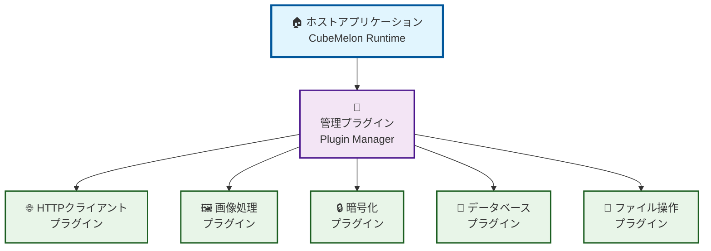
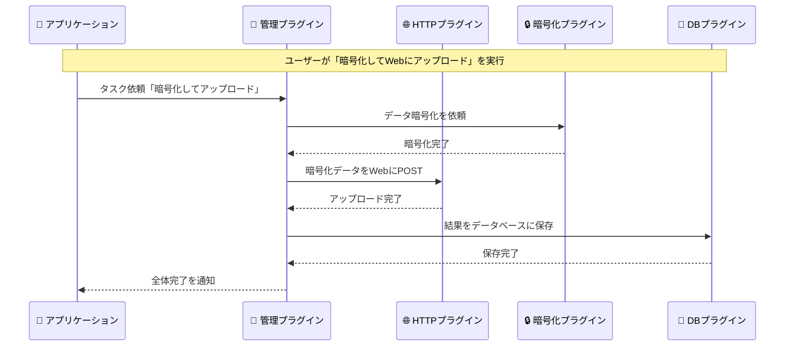
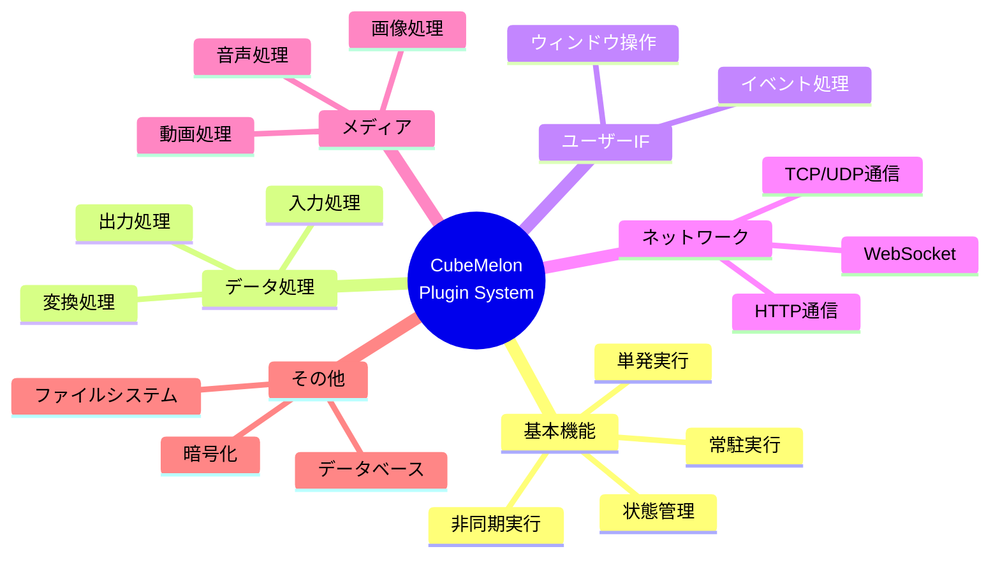

# CubeMelon Plugin System
An interactive plugin system designed for multiple languages v0.11.3

[ ENGLISH](README.md)


[](https://opensource.org/licenses/MIT)

---

## プロジェクト概要

`CubeMelon Plugin System` は、アプリケーションの機能を簡単に拡張できるプラグインシステムです。
さまざまなプログラミング言語でプラグインを作ることができますが、Rust SDK を使うことで特に簡単に開発できます。
作成したプラグイン同士は連携して動作させることができるほか、多言語に対応したアプリケーションを作ることが可能です。
最初は小さなアプリから始めて、必要に応じて機能をどんどん追加していけるのが特長です。

### ✨ どんなことができるのか

🍉 **簡単にプラグインが作れる**
- Rust なら最小十数行のコードでプラグインが完成
- 難しいメモリ管理は自動で処理
- エラー処理も自動で安全

🍉 **プラグイン同士が連携可能**
- 「画像を読み込む」プラグイン ＋ 「サイズを変更する」プラグイン = 画像リサイズ機能
- あとから新しいプラグインを追加するだけで機能アップ

🍉 **国際化対応**
- 日本語、英語、中国語など、多言語に対応可能
- UTF-8 ベースで文字化けの心配なし

🍉 **様々な言語で開発可能**
- Rust、C、C++、Go、Zigなど
- チームの得意な言語を使える
- C ABI で設計されている

### 🎯 こんな方におすすめ

- プログラミングを学んでいる方: 実践的なプラグイン開発を体験したい
- 小さなツールから始めたい方: シンプルなアプリを段階的に成長させたい
- Rustに興味がある方: 難しい部分はシステムにお任せして、楽しい部分に集中したい

---

## 目次

1. [クイックスタート](#クイックスタート)
2. [アーキテクチャの概要](#アーキテクチャの概要)
3. [プラグインの種類](#プラグインの種類)
4. [プラグイン開発ガイド](#プラグイン開発ガイド)
5. [ドキュメント](#ドキュメント)
6. [貢献する](#貢献する)
7. [ライセンス](#ライセンス)

---

## クイックスタート

```rust
use cubemelon_sdk::prelude::*;

#[plugin]
pub struct MyPlugin {
}

#[plugin_impl]
impl MyPlugin {
    pub fn new() -> Self { Self {} }
    pub fn get_uuid() -> CubeMelonUUID { uuid!("12345678-1234-5678-9abc-123456789abc") }
    pub fn get_version() -> CubeMelonVersion { version!(1, 0, 0) }
    pub fn get_supported_types() -> u64 { CubeMelonPluginType::Basic as u64 }
}

#[plugin_interface(basic)]
impl MyPlugin {}
```

### [Getting Started](docs/getting_started.ja.md) はこちら

[目次に戻る](#目次)

---

## アーキテクチャの概要

### 1. システム全体の階層構造

プラグインはホストアプリケーションを頂点として、階層構造を持つことができます。



### 2. プラグイン間の相互連携

プラグインは親プラグインとは直接、また兄弟プラグインとは親プラグインを介して相互に連携することができます。



### 3. インターフェイス別の機能分類

プラグインインターフェイスは最大63種類用意されており、基本機能を始めネットワーク通信やメディア処理、データベース操作に至るまで様々な用途に対応します。



詳しくは[仕様書](docs/specification/specification.ja.md)をご覧ください。

[目次に戻る](#目次)

---

## プラグインの種類

### 🔌 最大63種類

- 基本機能
  - 基本

- 標準機能
  - 単発実行（同期）
  - 単発実行（非同期）
  - 常駐自動実行
  - 状態管理
  - プラグイン管理
  - データ入力
  - データ出力
  - ウィンドウ操作

- 拡張機能（予定）
  - 画像処理
  - 音声処理
  - 映像処理
  - ローカルファイルシステム操作
  - データベース操作
  - 暗号化処理
  - TTP/HTTPS クライアント
  - TTP/HTTPS サーバー
  - CP クライアント
  - CP サーバー
  - DP 通信
  - ebSocket 通信
  - ファイル共有（SMB、AFP、NFS等）
  - サービス発見（Bonjour、UPnP等）
  - ストリーミング（RTP、WebRTC等）
  - メッセージング（MQTT、AMQP等）
  - ブロックチェーン通信
  - IoT プロトコル（CoAP等）

- ユーザー定義
  - その他
  - ...

詳しくは[仕様書](docs/specification/specification.ja.md)をご覧ください。

[目次に戻る](#目次)

---

## プラグイン開発ガイド

### 💭 どんなプラグインを作りたい？

プラグイン開発は「何をしたいか？」を決めることから始まります。
`CubeMelon Plugin System` では段階的に機能を追加していけるので、まずは簡単なものから始めましょう。

### 📝 プラグインタイプの選び方

🍉 **「何かの処理を1回だけ実行したい」**
- **基本プラグイン** または **単発実行プラグイン**
- 例：ファイルを変換する、計算する、データを整理する

🍉 **「バックグラウンドで動き続けたい」**
- **常駐プラグイン**
- 例：ファイル監視、定期的なデータ取得、サーバー機能

🍉 **「時間のかかる処理を非同期で実行したい」**
- **非同期プラグイン**
- 例：大きなファイルのダウンロード、画像の一括処理

🍉 **「設定や状態を保存したい」**
- **状態管理プラグイン**
- 例：ユーザー設定、履歴、キャッシュ

### 🚀 開発の流れ（3ステップ）

#### ステップ1：まずは基本プラグインから

```rust
// 最初はこれだけ
#[plugin]
pub struct MyPlugin {}

#[plugin_impl]
impl MyPlugin {
    pub fn new() -> Self { Self {} }
    // 基本情報の設定...
}
```

#### ステップ2：機能を追加する

```rust
// 単発実行機能を追加
#[single_task_plugin_impl]
impl MyPlugin {
    pub fn execute(&mut self, request: &TaskRequest, result: &mut TaskResult) {
        // ここに処理を書く
    }
}
```

#### ステップ3：さらに機能を組み合わせる

```rust
// 状態管理も追加
#[state_plugin_impl]
impl MyPlugin {
    pub fn save_state(&mut self, data: &[u8]) {
        // 設定を保存
    }
}
```

### 🛠️ 実際の開発例

「画像のファイル名を一括変更するプラグイン」を作る場合

1. 企画: ファイル名を変更したい → 単発実行プラグインが良さそう
2. 基本実装: まずは1つのファイルだけ処理
3. 機能拡張: 複数ファイル対応、エラーハンドリング追加
4. 応用: 設定保存機能を追加して、よく使うパターンを記憶

### ✨ 段階的実装の魅力

- 最初: 「Hello World」レベルから始められる
- 慣れてきたら: 他のプラグインと連携させる
- 上級者になったら: 複数のインターフェイスを組み合わせて高機能なプラグインに

### 💡 開発のコツ

- 小さく始める: 最初から完璧を目指さない
- 段階的に追加: 動くものから少しずつ機能を足す
- 既存プラグインを参考に: plugins/フォルダのサンプルを見てみる
- コミュニティを活用: 困ったときは気軽に質問

[目次に戻る](#目次)

  ---

## ドキュメント

### 👷‍♂️作成中👷‍♀️

[仕様書](docs/specification/specification.ja.md)はこちら

APIリファレンスは後日公開予定

[目次に戻る](#目次)

---

## 貢献する

`CubeMelon Plugin System` では、一緒に開発してくださる方を募集します。
まだまだ未実装の機能について、ご協力いただける方をお待ちしています。

[目次に戻る](#目次)

---

## ライセンス

**The MIT License**
<https://opensource.org/license/mit>

> Copyright© 2025 tapetums
> 
> Permission is hereby granted, free of charge, to any person obtaining a copy of this software and associated documentation files (the “Software”), to deal in the Software without restriction, including without limitation the rights to use, copy, modify, merge, publish, distribute, sublicense, and/or sell copies of the Software, and to permit persons to whom the Software is furnished to do so, subject to the following conditions:
> 
> The above copyright notice and this permission notice shall be included in all copies or substantial portions of the Software.
> 
> THE SOFTWARE IS PROVIDED “AS IS”, WITHOUT WARRANTY OF ANY KIND, EXPRESS OR IMPLIED, INCLUDING BUT NOT LIMITED TO THE WARRANTIES OF MERCHANTABILITY, FITNESS FOR A PARTICULAR PURPOSE AND NONINFRINGEMENT. IN NO EVENT SHALL THE AUTHORS OR COPYRIGHT HOLDERS BE LIABLE FOR ANY CLAIM, DAMAGES OR OTHER LIABILITY, WHETHER IN AN ACTION OF CONTRACT, TORT OR OTHERWISE, ARISING FROM, OUT OF OR IN CONNECTION WITH THE SOFTWARE OR THE USE OR OTHER DEALINGS IN THE SOFTWARE.

[先頭に戻る](#cubemelon-plugin-system)