# CubeMelon Plugin System
An interactive plugin system designed for multiple languages v0.11.3


[](https://opensource.org/licenses/MIT)

[ 日本語](README.ja.md)

---

## Project Overview

The `CubeMelon Plugin System` is a plugin system that makes it easy to extend application functionality.
While you can create plugins in various programming languages, using the Rust SDK makes development especially straightforward.
Created plugins can work together collaboratively, and you can build applications that support multiple languages.
The key feature is starting with small apps and gradually adding functionality as needed.

### ✨ What Can You Do?

🍉 **Easy Plugin Creation**
- With Rust, plugins can be completed in just a few dozen lines of code
- Complex memory management is handled automatically
- Error handling is also automatic and safe

🍉 **Plugin Collaboration**
- "Image Loading" plugin + "Image Resizing" plugin = Image resize functionality
- Simply add new plugins later to enhance functionality

🍉 **Internationalization Support**
- Support for multiple languages including Japanese, English, Chinese, and more
- UTF-8 based with no character encoding worries

🍉 **Development in Various Languages**
- Rust, C, C++, Go, Zig, and more
- Use your team's preferred language
- Designed with C ABI

### 🎯 Recommended For

- **Programming learners**: Want to experience practical plugin development
- **Those starting with small tools**: Want to grow simple apps step by step
- **Those interested in Rust**: Want to focus on the fun parts while letting the system handle the difficult aspects

---

## Table of Contents

1. [Quick Start](#quick-start)
2. [Architecture Overview](#architecture-overview)
3. [Plugin Types](#plugin-types)
4. [Plugin Development Guide](#plugin-development-guide)
5. [Documentation](#documentation)
6. [Contributing](#contributing)
7. [License](#license)

---

## Quick Start

```rust
use cubemelon_sdk::prelude::*;

#[plugin]
pub struct MyPlugin {
}

#[plugin_impl]
impl MyPlugin {
    pub fn new() -> Self { Self {} }
    pub fn get_uuid() -> CubeMelonUUID { uuid!("12345678-1234-5678-9abc-123456789abc") }
    pub fn get_version() -> CubeMelonVersion { version!(1, 0, 0) }
    pub fn get_supported_types() -> u64 { CubeMelonPluginType::Basic as u64 }
}

#[plugin_interface(basic)]
impl MyPlugin {}
```

### [Getting Started](docs/getting_started.en.md) is here

[Back to Table of Contents](#table-of-contents)

---

## Architecture Overview

### 1. System-wide Hierarchical Structure

Plugins can form a hierarchical structure with the host application at the top.

```mermaid
  graph TD
      Host[🏠 Host Application<br/>CubeMelon Runtime] --> Manager[🔧
  Management Plugin<br/>Plugin Manager]

      Manager --> P1[🌐 HTTP Client<br/>Plugin]
      Manager --> P2[🖼️ Image Processing<br/>Plugin]
      Manager --> P3[🔒 Encryption<br/>Plugin]
      Manager --> P4[💾 Database<br/>Plugin]
      Manager --> P5[📁 File Operation<br/>Plugin]

      classDef hostStyle fill:#e1f5fe,stroke:#01579b,stroke-width:3px
      classDef managerStyle fill:#f3e5f5,stroke:#4a148c,stroke-width:2px
      classDef pluginStyle fill:#e8f5e8,stroke:#1b5e20,stroke-width:2px

      class Host hostStyle
      class Manager managerStyle
      class P1,P2,P3,P4,P5 pluginStyle
```



### 2. Inter-Plugin Collaboration

Plugins can collaborate directly with parent plugins and with sibling plugins through the parent plugin.

```mermaid
  sequenceDiagram
      participant App as 📱 Application
      participant Mgr as 🔧 Management Plugin
      participant HTTP as 🌐 HTTP Plugin
      participant Crypto as 🔒 Encryption Plugin
      participant DB as 💾 DB Plugin

      Note over App,DB: User executes "Encrypt and Upload to Web"

      App->>Mgr: Task request "Encrypt and upload"
      Mgr->>Crypto: Request data encryption
      Crypto-->>Mgr: Encryption complete
      Mgr->>HTTP: POST encrypted data to web
      HTTP-->>Mgr: Upload complete
      Mgr->>DB: Save result to database
      DB-->>Mgr: Save complete
      Mgr-->>App: Notify overall completion
```



### 3. Feature Classification by Interface

Up to 63 plugin interfaces are available, supporting various use cases from basic functionality to network communication, media processing, and database operations.


For more details, see the [Specification](docs/specification/specification.en.md).

[Back to Table of Contents](#table-of-contents)

---

## Plugin Types

### 🔌 Up to 63 Types

- Core Features
  - Basic

- Standard Features
  - Single Task (Sync)
  - Single Task (Async)
  - Resident Auto-execution
  - State Management
  - Plugin Management
  - Data Input
  - Data Output
  - Window Operations

- Extended Features (Planned)
  - Image Processing
  - Audio Processing
  - Video Processing
  - Local File System Operations
  - Database Operations
  - Encryption Processing
  - HTTP/HTTPS Client
  - HTTP/HTTPS Server
  - TCP Client
  - TCP Server
  - UDP Communication
  - WebSocket Communication
  - File Sharing (SMB, AFP, NFS, etc.)
  - Service Discovery (Bonjour, UPnP, etc.)
  - Streaming (RTP, WebRTC, etc.)
  - Messaging (MQTT, AMQP, etc.)
  - Blockchain Communication
  - IoT Protocols (CoAP, etc.)

- User-Defined
  - Others
  - ...

For more details, see the [Specification](docs/specification/specification.en.md).

[Back to Table of Contents](#table-of-contents)

---

## Plugin Development Guide

### 💭 What Kind of Plugin Do You Want to Create?

Plugin development starts with deciding "what do you want to do?"
With the `CubeMelon Plugin System`, you can add functionality incrementally, so let's start with something simple.

### 📝 How to Choose Plugin Types

🍉 **"Want to execute some process just once?"**
- **Basic Plugin** or **Single Task Plugin**
- Examples: Convert files, perform calculations, organize data

🍉 **"Want to keep running in the background?"**
- **Resident Plugin**
- Examples: File monitoring, periodic data retrieval, server functionality

🍉 **"Want to execute time-consuming processes asynchronously?"**
- **Async Plugin**
- Examples: Large file downloads, bulk image processing

🍉 **"Want to save settings or state?"**
- **State Management Plugin**
- Examples: User settings, history, cache

### 🚀 Development Flow (3 Steps)

#### Step 1: Start with a Basic Plugin

```rust
// Start with just this
#[plugin]
pub struct MyPlugin {}

#[plugin_impl]
impl MyPlugin {
    pub fn new() -> Self { Self {} }
    // Basic information setup...
}
```

#### Step 2: Add Functionality

```rust
// Add single task functionality
#[single_task_plugin_impl]
impl MyPlugin {
    pub fn execute(&mut self, request: &TaskRequest, result: &mut TaskResult) {
        // Write your processing here
    }
}
```

#### Step 3: Combine Even More Features

```rust
// Add state management too
#[state_plugin_impl]
impl MyPlugin {
    pub fn save_state(&mut self, data: &[u8]) {
        // Save settings
    }
}
```

### 🛠️ Real Development Example

When creating a "batch image filename changer plugin":

1. Planning: Want to change filenames → Single task plugin seems good
2. Basic implementation: Process just one file first
3. Feature expansion: Add multiple file support, error handling
4. Application: Add settings save functionality to remember frequently used patterns

### ✨ Benefits of Incremental Implementation

- **Initially**: Start from "Hello World" level
- **As you get comfortable**: Make plugins collaborate with others
- **When you become advanced**: Combine multiple interfaces for highly functional plugins

### 💡 Development Tips

- **Start small**: Don't aim for perfection from the beginning
- **Add incrementally**: Add features bit by bit from something that works
- **Reference existing plugins**: Look at samples in the plugins/ folder
- **Use the community**: Feel free to ask questions when stuck

[Back to Table of Contents](#table-of-contents)

  ---

## Documentation

### 👷‍♂️Under Construction👷‍♀️

[Specification](docs/specification/specification.en.md) is here

API Reference will be published later

[Back to Table of Contents](#table-of-contents)

---

## Contributing

The `CubeMelon Plugin System` is looking for contributors to develop together.
We welcome anyone who can help with the many features that are still unimplemented.

[Back to Table of Contents](#table-of-contents)

---

## License

**The MIT License**
<https://opensource.org/license/mit>

> Copyright© 2025 tapetums
> 
> Permission is hereby granted, free of charge, to any person obtaining a copy of this software and associated documentation files (the "Software"), to deal in the Software without restriction, including without limitation the rights to use, copy, modify, merge, publish, distribute, sublicense, and/or sell copies of the Software, and to permit persons to whom the Software is furnished to do so, subject to the following conditions:
> 
> The above copyright notice and this permission notice shall be included in all copies or substantial portions of the Software.
> 
> THE SOFTWARE IS PROVIDED "AS IS", WITHOUT WARRANTY OF ANY KIND, EXPRESS OR IMPLIED, INCLUDING BUT NOT LIMITED TO THE WARRANTIES OF MERCHANTABILITY, FITNESS FOR A PARTICULAR PURPOSE AND NONINFRINGEMENT. IN NO EVENT SHALL THE AUTHORS OR COPYRIGHT HOLDERS BE LIABLE FOR ANY CLAIM, DAMAGES OR OTHER LIABILITY, WHETHER IN AN ACTION OF CONTRACT, TORT OR OTHERWISE, ARISING FROM, OUT OF OR IN CONNECTION WITH THE SOFTWARE OR THE USE OR OTHER DEALINGS IN THE SOFTWARE.

[Back to Top](#cubemelon-plugin-system)