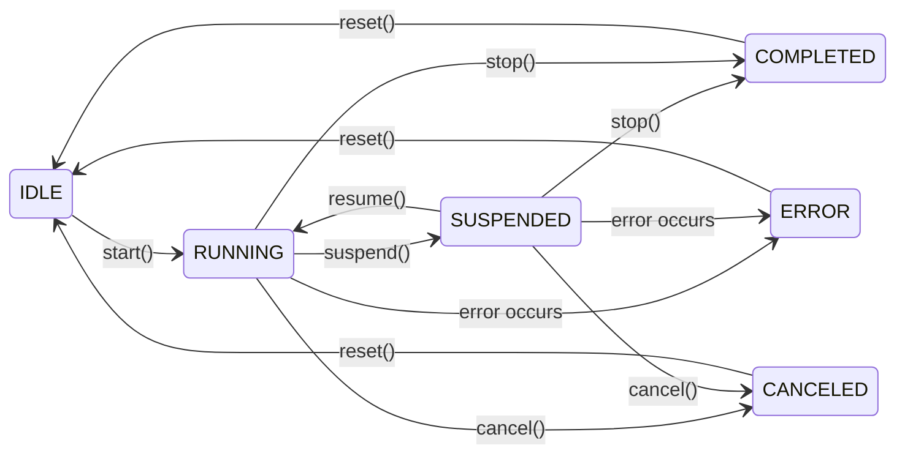

# CubeMelon Plugin System Specification
2025/09/07
PLUGIN_SDK_VERSION 0.11.3

[ JAPANESE](specification.ja.md)

---

## Table of Contents

1. [Overview](#1-overview)
2. [Basic Data Structures](#2-basic-data-structures)
3. [C ABI Interface](#3-c-abi-interface)
4. [Entry Points](#4-entry-points)
5. [String Specification](#5-string-specification)
6. [Error Handling](#6-error-handling)
7. [Memory Management](#7-memory-management)
8. [Thread Safety](#8-thread-safety)
9. [Implementation Examples (Rust SDK)](#9-implementation-examples-rust-sdk)
10. [Plugin Interoperability](#10-plugin-interoperability)
11. [Versioning and Compatibility](#11-versioning-and-compatibility)
12. [Debug and Logging](#12-debug-and-logging)
13. [Implementation Burden Reduction](#13-implementation-burden-reduction)
14. [Conclusion](#14-conclusion)

---

## 1. Overview

This plugin system is an extensible architecture designed to dynamically load plugins with diverse functionality and enable their interoperability. Plugins collaborate through the C ABI and can be implemented in C, C++, Rust, and other languages.

[Back to Table of Contents](#table-of-contents)

---

## 2. Basic Data Structures

### 2.1 UUID (Plugin File Identifier)

```c
typedef struct {
    uint8_t bytes[16];
} CubeMelonUUID;
```

- A 128-bit UUID for identifying plugin files (DLL/shared libraries).
- All plugin instances created from the same file share the same UUID, guaranteeing global uniqueness between files.

### 2.2 Version Information

```c
typedef struct {
    uint16_t major;    // Major version
    uint8_t  minor;    // Minor version  
    uint8_t  patch;    // Patch version
} CubeMelonVersion;
```

A 4-byte structure supporting semantic versioning.

### 2.3 Language Identification

```c
typedef struct CubeMelonLanguage {
    const char8_t* code; // UTF-8, NULL-terminated, BCP 47 format
} CubeMelonLanguage;
```

Languages are identified by UTF-8 strings compliant with [BCP 47](https://www.rfc-editor.org/rfc/bcp/bcp47.txt).

#### [Examples]
`en-US`, `ja-JP`, `zh-Hant-TW`, etc...

##### [Notes]
- `code` must be a hyphen-separated, normalized string (BCP 47 compliant)
- `code` must be a NULL-terminated string (maximum 255 bytes including NULL)
- Language tags are case-sensitive and must be in BCP 47 canonical form (en-US, ja-JP, zh-Hant-TW)
- Different case variations are treated as unknown languages
- Unknown languages, even if normalized, all fall back to `en-US`
- The host maintains language setting information and provides it to plugins through interfaces
- Fields may be added to the structure in future extensions

### 2.4 Plugin Type (64-bit Flags)

```c
// Plugin type (64-bit flags)
typedef uint64_t CubeMelonPluginType;

// Basic
static const uint64_t PLUGIN_TYPE_BASIC = 0; // Basic interface only

// Execution patterns (core features)
static const uint64_t PLUGIN_TYPE_SINGLE_TASK        = 0x0000000000000001ULL; // Single execution (sync)
static const uint64_t PLUGIN_TYPE_ASYNC_TASK         = 0x0000000000000002ULL; // Single execution (async)
static const uint64_t PLUGIN_TYPE_RESIDENT           = 0x0000000000000004ULL; // Resident auto-execution
static const uint64_t PLUGIN_TYPE_STATE              = 0x0000000000000008ULL; // State management
static const uint64_t PLUGIN_TYPE_MANAGER            = 0x0000000000000010ULL; // Plugin management

// Data processing
static const uint64_t PLUGIN_TYPE_DATA_INPUT         = 0x0000000000000020ULL; // Data input
static const uint64_t PLUGIN_TYPE_DATA_OUTPUT        = 0x0000000000000040ULL; // Data output

// User interface
static const uint64_t PLUGIN_TYPE_WINDOW             = 0x0000000000000080ULL; // Window operations

// Media processing
static const uint64_t PLUGIN_TYPE_IMAGE              = 0x0000000000000100ULL; // Image processing
static const uint64_t PLUGIN_TYPE_AUDIO              = 0x0000000000000200ULL; // Audio processing
static const uint64_t PLUGIN_TYPE_VIDEO              = 0x0000000000000400ULL; // Video processing

// File system & storage
static const uint64_t PLUGIN_TYPE_FILE_SYSTEM        = 0x0000000000000800ULL; // Local file system operations
static const uint64_t PLUGIN_TYPE_DATABASE           = 0x0000000000001000ULL; // Database operations

// Security
static const uint64_t PLUGIN_TYPE_ENCRYPTION         = 0x0000000000002000ULL; // Encryption processing

// Network communication
static const uint64_t PLUGIN_TYPE_HTTP_CLIENT        = 0x0000000000100000ULL; // HTTP/HTTPS client
static const uint64_t PLUGIN_TYPE_HTTP_SERVER        = 0x0000000000200000ULL; // HTTP/HTTPS server
static const uint64_t PLUGIN_TYPE_TCP_CLIENT         = 0x0000000000400000ULL; // TCP client
static const uint64_t PLUGIN_TYPE_TCP_SERVER         = 0x0000000000800000ULL; // TCP server
static const uint64_t PLUGIN_TYPE_UDP_SOCKET         = 0x0000000001000000ULL; // UDP communication
static const uint64_t PLUGIN_TYPE_WEBSOCKET          = 0x0000000002000000ULL; // WebSocket communication
static const uint64_t PLUGIN_TYPE_FILE_SHARING       = 0x0000000004000000ULL; // File sharing (SMB, AFP, NFS, etc.)
static const uint64_t PLUGIN_TYPE_SERVICE_DISCOVERY  = 0x0000000008000000ULL; // Service discovery (Bonjour, UPnP, etc.)

// Future extensions (examples)
static const uint64_t PLUGIN_TYPE_STREAMING          = 0x0000000010000000ULL; // Streaming (RTP, WebRTC, etc.)
static const uint64_t PLUGIN_TYPE_MESSAGING          = 0x0000000020000000ULL; // Messaging (MQTT, AMQP, etc.)
static const uint64_t PLUGIN_TYPE_BLOCKCHAIN         = 0x0000000040000000ULL; // Blockchain communication
static const uint64_t PLUGIN_TYPE_IOT                = 0x0000000080000000ULL; // IoT protocols (CoAP, etc.)

// 32-62 bits are reserved as user-defined area
static const uint64_t PLUGIN_TYPE_USER_DEFINED_START = 0x0000000100000000ULL; // 2^32
static const uint64_t PLUGIN_TYPE_USER_DEFINED_END   = 0x4000000000000000ULL; // 2^62

// SDK internal use (prohibited) - using this will make the plugin invalid
static const uint64_t PLUGIN_TYPE_RESERVED = 0x8000000000000000ULL;
```

#### [Usage Examples]

Multiple features can be combined:

```c
// Web server plugin
CubeMelonPluginType web_server = 
    PLUGIN_TYPE_HTTP_SERVER |     // HTTP server functionality
    PLUGIN_TYPE_WEBSOCKET |       // WebSocket support  
    PLUGIN_TYPE_FILE_SYSTEM;      // Static file serving

// IoT gateway plugin  
CubeMelonPluginType iot_gateway = 
    PLUGIN_TYPE_IOT |             // IoT protocols
    PLUGIN_TYPE_ENCRYPTION |      // Security
    PLUGIN_TYPE_DATABASE;         // Data storage
```

### 2.5 Plugin Execution Status

```c
typedef enum {
    EXECUTION_STATUS_IDLE      = 0,  // Idle/waiting
    EXECUTION_STATUS_RUNNING   = 1,  // Running
    EXECUTION_STATUS_SUSPENDED = 2,  // Suspended
    EXECUTION_STATUS_COMPLETED = 3,  // Completed
    EXECUTION_STATUS_ERROR     = 4,  // Error
    EXECUTION_STATUS_CANCELLED = 5,  // Cancelled
} CubeMelonExecutionStatus;
```

### 2.6 Types of State Held by Plugins

```c
typedef enum {
    PLUGIN_STATE_SCOPE_LOCAL  = 0, // Plugin's own internal state
    PLUGIN_STATE_SCOPE_HOST   = 1, // Host environment (language settings, timezone, etc.)
    PLUGIN_STATE_SCOPE_SHARED = 2, // State shared with other plugins (images, history, etc.)
} CubeMelonPluginStateScope;
```

### 2.7 Thread Requirements

```c
typedef enum {
    THREAD_REQ_NO_REQUIREMENTS = 0,
    THREAD_REQ_UI_THREAD       = 1 << 0,    // Must execute on UI thread
    THREAD_REQ_BACKGROUND      = 1 << 1,    // Background thread recommended
    THREAD_REQ_HIGH_PRIORITY   = 1 << 2,    // High priority thread recommended
    THREAD_REQ_LOW_PRIORITY    = 1 << 3,    // Low priority thread recommended
} CubeMelonThreadRequirements;
```

### 2.8 Task Types

```c
typedef enum {
    TASK_TYPE_NONE = 0,
    
    // Basic tasks (1-19)
    TASK_TYPE_GENERIC            = 1,
    TASK_TYPE_FILE_IO            = 2,
    TASK_TYPE_DATABASE           = 3,
    TASK_TYPE_COMPUTATION        = 4,
    TASK_TYPE_WINDOW             = 5,
    TASK_TYPE_IMAGE              = 6,          
    TASK_TYPE_AUDIO              = 7,
    TASK_TYPE_VIDEO              = 8,
    // 9-19: Reserved for future basic features

    // Network tasks (20-39)
    TASK_TYPE_HTTP               = 20,
    TASK_TYPE_TCP                = 21,
    TASK_TYPE_UDP                = 22,
    TASK_TYPE_WEBSOCKET          = 23,
    TASK_TYPE_FILE_SHARING       = 24, // SMB, etc.
    TASK_TYPE_SERVICE_DISCOVERY  = 25, // Bonjour, etc.
    TASK_TYPE_GRPC               = 26,
    TASK_TYPE_MQTT               = 27,
    TASK_TYPE_GRAPHQL            = 28,
    // 29-39: Reserved for future network protocols

    // Extended tasks (40-99)
    // Project-specific features

    // User-defined (100-65535)
    TASK_TYPE_USER_DEFINED_START = 100,
    TASK_TYPE_USER_DEFINED_END   = 65535,

} CubeMelonTaskType;
```

### 2.9 Task Structures and Callback Functions

```c
// Structure containing task execution information
#pragma pack(push, 8)
typedef struct {
    const CubeMelonPlugin* caller;       // Calling plugin
    CubeMelonValue* input_data;          // Input data (managed by caller)
    CubeMelonString input_json;          // Additional information (JSON format)
    CubeMelonTaskType task_type;         // Task type
    const CubeMelonLanguage language;    // Caller's language setting
    int64_t request_time_us;             // Call time (UTC microseconds)
    int64_t timeout_us;                  // Timeout for async execution (microseconds)
    void* user_data;                     // Application-specific data
    void* reserved[2];                   // Future extensions
} CubeMelonTaskRequest;
#pragma pack(pop)
```

```c
// Structure containing task execution results
#pragma pack(push, 8)
typedef struct {
    const CubeMelonPlugin* callee;       // Plugin that executed
    CubeMelonValue* output_data;         // Output data (allocated by plugin)
    CubeMelonString output_json;         // Additional information (JSON format)
    CubeMelonExecutionStatus status;     // Execution status
    CubeMelonPluginErrorCode error_code; // Error code
    int64_t completion_time_us;          // Completion time (UTC microseconds)
    double progress_ratio;               // Progress ratio [0.0, 1.0]
    CubeMelonString progress_message;    // Progress information
    CubeMelonString progress_stage;      // Progress message
    uint64_t estimated_remaining_us;     // Estimated remaining time (microseconds)
    void* reserved[2];                   // Future extensions
} CubeMelonTaskResult;
#pragma pack(pop)
```

```c
// Callback function for async tasks
typedef void (*CubeMelonTaskCallback)(
    CubeMelonTaskRequest* request,
    const CubeMelonTaskResult* result
);
```

```c
// Definition of invalid time representation
#define CUBEMELON_TIMESTAMP_INVALID (-1LL)
```

#### ⚠️ Warning ⚠️

- **Always** assign NULL or 0 to unused fields

##### [Field Details]
- `request_time_us`, `completed_time_us`: == 0 means 1970-01-01 00:00:00 (UTC)
- `progress_ratio`: < 0.0 means progress ratio is unknown, [0.0, 1.0] range expresses progress
- `progress_message`: Message in the language specified by `request->language.code`
- `progress_stage`: "downloading", "processing", "uploading", etc...
- `estimated_remaining_us`: == **-1** means remaining time is unknown

##### [Time Handling]
- At task start: Set current UTC microseconds to `request_time_us`
- When task not completed: Set **-1** to `completion_time_us` (treated as invalid value)
- When task completed: Set completion UTC microseconds to `completion_time_us`
- Example check: `if (result->completed_time_us > 0) { /* completed */ }`

##### [Behavior on Error]

When `status == EXECUTION_STATUS_ERROR`:
- `error_code` contains error details
- `output_data` is usually empty (may be set if partial results exist)
- Progress-related fields retain their last values

### 2.10 Plugin Basic Information

```c
// Basic information structure
#pragma pack(push, 8)
typedef struct {
    CubeMelonUUID uuid;                  // Plugin UUID
    CubeMelonVersion version;            // Plugin version
    CubeMelonPluginType supported_types; // Supported features
    const CubeMelonString name;          // Name in specified language
    const CubeMelonString description;   // Description in specified language
} CubeMelonPluginBasicInfo;
#pragma pack(pop)
```

### 2.11 Services Provided by Host

```c
// Services provided by host
typedef struct {
    // Log output
    void (*log)(CubeMelonLogLevel level, const char8_t* plugin_name, const char8_t* message);

    // Language information retrieval
    CubeMelonLanguage (*get_system_language)(void);
    
    // Access to host plugin functionality
    CubeMelonPluginErrorCode (*get_host_interface)(
        CubeMelonPluginType interface_type,
        uint32_t interface_version,
        const CubeMelonPlugin** plugin,
        const void** interface
    );

    // Other host services can be added in the future
    // void (*get_system_time)(CubeMelonTime* out_time);
    // const char8_t* (*get_app_data_directory)(void);
} CubeMelonHostServices;
```

### 2.12 Time Handling Structure

```c
#pragma pack(push, 8)
typedef struct {
    int32_t year;               // Year (1970-9999)
    uint8_t month;              // Month (1-12)
    uint8_t day;                // Day (1-31)
    uint8_t weekday;            // Weekday (0 == Sunday)
    uint8_t hour;               // Hour (0-23)
    uint8_t minute;             // Minute (0-59)
    uint8_t second;             // Second (0-60)
    uint16_t millisecond;       // Millisecond (0-999)
    uint16_t microsecond;       // Microsecond (0-999)
    int16_t utc_offset_minutes; // UTC offset (minutes)
    char8_t tz_name[32];        // UTF-8 (NULL-terminated)
} CubeMelonTime;
#pragma pack(pop)
```

[Back to Table of Contents](#table-of-contents)

---

## 3. C ABI Interface

### 3.1 Basic Structures

#### 3.1.1 Safe Memory Management Structures

```c
// For strings
#pragma pack(push, 8)
typedef struct {
    const char8_t* str;
    void (*free_string)(const char8_t* str);
} CubeMelonString;
#pragma pack(pop)
```

```c
// For UUID arrays  
#pragma pack(push, 8)
typedef struct {
    CubeMelonUUID* uuids;
    size_t count;
    void (*free_uuid_array)(CubeMelonUUID* uuids, size_t count);
} CubeMelonUUIDArray;
#pragma pack(pop)
```

```c
// For basic information arrays
#pragma pack(push, 8)
typedef struct {
    CubeMelonPluginBasicInfo* infos;
    size_t count;
    void (*free_info_array)(CubeMelonPluginBasicInfo* infos, size_t count);
} CubeMelonPluginBasicInfoArray;
#pragma pack(pop)
```

```c
typedef enum {
    Null, Bool, Int, UInt, Float, Pointer, String, Buffer, Array,
    Custom = UINT32_MAX,
} CubeMelonValueTag;

typedef struct CubeMelonValue CubeMelonValue;

// Generic hierarchical data structure
#pragma pack(push, 8)
struct CubeMelonValue {
    CubeMelonValueTag tag;
    uint32_t reserved;
    union {
        void* pointer;
        union {
            bool      b; // boolean
            intptr_t  i; // integer
            uintptr_t u; // unsigned integer
            double    f; // float
        } number;
        struct {
            const char8_t* str;
        } string;
        struct {
            size_t count;
            const void* data;
        } buffer;
        struct {
            size_t count;
            const CubeMelonValue* items;
        } array;
    } data;
    void (*free_value)(CubeMelonValue* value);
};
#pragma pack(pop)
```

##### ⚠️ Warning ⚠️
Users **must** call `free_*()` functions to deallocate memory after use

#### 3.1.2 Plugin Structure

```c
typedef struct CubeMelonPlugin CubeMelonPlugin;
```

- `CubeMelonPlugin` structure is defined as an opaque type
- Internal structure is not directly accessible from outside
- Ensures safety and encapsulation

### 3.2 Plugin Interface

Operations on `CubeMelonPlugin` are performed through dedicated methods:

#### 3.2.1 Basic Interface

This is the interface that should be obtained first when a plugin instance is created. It is obtained through the `get_plugin_interface()` C ABI function.

```c
typedef struct {
    // Basic information retrieval
    CubeMelonUUID (*get_uuid)(void);
    CubeMelonVersion (*get_version)(void);
    CubeMelonPluginType (*get_supported_types)(void);

    // Thread safety
    bool (*is_thread_safe)(void);
    CubeMelonThreadRequirements (*get_thread_requirements)(void);

    // Instance-specific information
    const char8_t* (*get_name)(
        const CubeMelonPlugin* plugin,
        const CubeMelonLanguage language
    );
    const char8_t* (*get_description)(
        const CubeMelonPlugin* plugin,
        const CubeMelonLanguage language
    );

    // Lifecycle management
    CubeMelonPluginErrorCode (*initialize)(
        CubeMelonPlugin* plugin, 
        const CubeMelonHostServices* host_services
    );
    CubeMelonPluginErrorCode (*uninitialize)(
        CubeMelonPlugin* plugin
    );

} CubeMelonInterface;
```

##### [Method Safety]

- The `initialize()` and `uninitialize()` methods must **be safely callable multiple times**. When called in an already initialized/uninitialized state, they should return appropriate error codes.
###### [Example]
```c
typedef struct {
    bool initialized;
    // Other data...
} MyPluginData;
```
- During initialization
```c
CubeMelonPluginErrorCode initialize(
    CubeMelonPlugin* plugin, 
    const CubeMelonHostServices* host_services
) {
    if (plugin == NULL) {
        return PLUGIN_ERROR_NULL_POINTER;
    }
    
    MyPluginData* data = (MyPluginData*)plugin;
    if (data->initialized) {
        // If already initialized, return control without doing anything
        return PLUGIN_ERROR_ALREADY_INITIALIZED;
    }

    /* Initialization processing... */
    
    data->initialized = true; // Prevent double initialization

    return PLUGIN_SUCCESS;
}
```
- During termination
```c
CubeMelonPluginErrorCode uninitialize(
    CubeMelonPlugin* plugin
) {
    if (plugin == NULL) {
        return PLUGIN_ERROR_NULL_POINTER;
    }
    
    PluginData* data = (PluginData*)plugin;
    if (!data->initialized) {
        // If already uninitialized, return control without doing anything
        return PLUGIN_ERROR_NOT_INITIALIZED;
    }

    /* Termination processing... */
    
    data->initialized = false; // Prevent double termination
    
    return PLUGIN_SUCCESS;
}
```

### 3.3 Standard Interfaces

Plugins provide feature-specific interfaces through the `get_plugin_interface()` C ABI function. Below are standard interface definitions.

#### 3.3.1 Single Task Interface (Synchronous)

Executes a single task. Execution is synchronous, and control returns to the caller after task completion.

```c
typedef struct {
    // Task execution (synchronous)
    // Caller deallocates with free_*()
    CubeMelonPluginErrorCode (*execute)(
        CubeMelonPlugin* plugin,
        const CubeMelonTaskRequest* request,
        CubeMelonTaskResult* result
    );

} CubeMelonSingleTaskInterface;
```

##### [Notes]
- Both `CubeMelonTaskRequest` and `CubeMelonTaskResult` objects are created by the caller.
- Both `CubeMelonTaskRequest` and `CubeMelonTaskResult` objects are destroyed by the caller after control returns upon task execution completion.

#### 3.3.2 Single Task Interface (Asynchronous)

Executes a single task. Execution is asynchronous, and control returns to the caller immediately. Callback functions are used to receive execution results.

```c
typedef struct {
    // Task execution (asynchronous)
    CubeMelonPluginErrorCode (*execute)(
        CubeMelonPlugin* plugin,
        CubeMelonTaskRequest* request,
        CubeMelonTaskCallback callback
    );

    // Cancel asynchronous execution
    // Caller deallocates with free_*()
    CubeMelonPluginErrorCode (*cancel)(
        CubeMelonPlugin* plugin,
        CubeMelonTaskRequest* request
    );

} CubeMelonAsyncTaskInterface;
```

##### [Notes]
- The plugin side must check whether the callback function is NULL. If NULL, no result will be notified.
- `CubeMelonTaskRequest` objects are created by the caller and destroyed within the callback function.
- `CubeMelonTaskResult` objects are created by the plugin side and destroyed by the plugin side after the callback function ends and control returns to the plugin side.
- For `cancel()`, the caller destroys the `CubeMelonTaskRequest` object after operation completion. However, care must be taken to avoid double destruction of the same object within the callback function.
- If a `CubeMelonTaskRequest` object has already been destroyed before calling `cancel()`, the operation is ignored.

#### 3.3.3 Resident Interface

Resides in memory and automatically executes tasks according to configuration. Configuration is done in user-defined JSON format.

```c
typedef struct {
    // Get service status
    CubeMelonExecutionStatus (*get_status)(
        const CubeMelonPlugin* plugin
    );

    // Get current configuration
    const char8_t* (*get_configuration)(
        const CubeMelonPlugin* plugin
    );

    // Change configuration during execution
    CubeMelonPluginErrorCode (*update_configuration)(
        CubeMelonPlugin* plugin,
        const char8_t* config_json
    );
    
    // Start service
    // On success: IDLE -> RUNNING
    // Error when not EXECUTION_STATUS_IDLE
    CubeMelonPluginErrorCode (*start)(
        CubeMelonPlugin* plugin,
        const char8_t* config_json
    );
    
    // Suspend service
    // On success: RUNNING -> SUSPENDED
    // Error when not EXECUTION_STATUS_RUNNING
    CubeMelonPluginErrorCode (*suspend)(
        CubeMelonPlugin* plugin
    );

    // Resume service
    // Error when not EXECUTION_STATUS_SUSPENDED
    CubeMelonPluginErrorCode (*resume)(
        CubeMelonPlugin* plugin
    );

    // Stop service
    CubeMelonPluginErrorCode (*stop)(
        CubeMelonPlugin* plugin
    );

    // Return to initial state
    // Error when not EXECUTION_STATUS_COMPLETED or EXECUTION_STATUS_ERROR
    CubeMelonPluginErrorCode (*reset)(
        CubeMelonPlugin* plugin
    );

} CubeMelonResidentInterface;
```

##### [State Transition Table]
| Function | Callable States | State After Transition | Notes | 
|---|---|---|---|
| start() | IDLE | RUNNING | Initial data available | 
| suspend() | RUNNING | SUSPENDED | Pause | 
| resume() | SUSPENDED | RUNNING | Resume | 
| stop() | RUNNING, SUSPENDED | COMPLETED | Termination processing | 
| cancel()* | RUNNING, SUSPENDED | CANCELED | Cancel state |
| reset() | COMPLETED, ERROR, CANCELED | IDLE | Ready for reuse | 

##### [State Transition Diagram]


*`cancel()` is not a method of `CubeMelonResidentInterface`, but is listed here for comprehensive state transitions

#### 3.3.4 State Management Interface

Maintains plugin state and supports data persistence and supply to other plugins.

```c
typedef struct {
    // Save/restore state data
    // Caller creates data, plugin sets data content, content freed with data.free_value()
    CubeMelonPluginErrorCode (*load_state)(
        CubeMelonPlugin* plugin,
        CubeMelonPluginStateScope scope,
        CubeMelonValue* data
    );
    CubeMelonPluginErrorCode (*save_state)(
        CubeMelonPlugin* plugin,
        CubeMelonPluginStateScope scope,
        const void* data,
        size_t size
    );

    // Get state data format name
    // Examples: "json", "toml", "msgpack"...
    const char8_t* (*get_format_name)(
        const CubeMelonPlugin* plugin,
        CubeMelonPluginStateScope scope
    );

    // Set/get state data for specific key
    // Caller creates value, plugin sets value content, content freed with value.free_value()
    CubeMelonPluginErrorCode (*get_state_value)(
        const CubeMelonPlugin* plugin,
        CubeMelonPluginStateScope scope,
        const char8_t* key,
        CubeMelonValue* value
    );
    CubeMelonPluginErrorCode (*set_state_value)(
        CubeMelonPlugin* plugin,
        CubeMelonPluginStateScope scope, 
        const char8_t* key,
        const void* data,
        size_t size
    );
    
    // Get list and count of state data
    // Caller creates keys, plugin sets keys content, content freed with keys.free_value()
    CubeMelonPluginErrorCode (*list_state_keys)(
        const CubeMelonPlugin* plugin,
        CubeMelonPluginStateScope scope,
        CubeMelonValue* keys
    );

    // Delete state data for specific key
    CubeMelonPluginErrorCode (*clear_state_value)(
        CubeMelonPlugin* plugin,
        CubeMelonPluginStateScope scope,
        const char8_t* key
    );

} CubeMelonPluginStateInterface;
```

#### 3.3.5 Plugin Management Interface

Manages loaded plugins and mediates task execution across plugins.

```c
typedef struct {
    // Batch retrieval of basic information for all plugins (for UI)
    // Caller deallocates with out_infos.free_array()
    CubeMelonPluginErrorCode (*get_all_plugins_basic_info)(
        const CubeMelonPlugin* plugin,
        const CubeMelonLanguage language,
        CubeMelonPluginBasicInfoArray* out_infos
    );

    // Detailed information for single plugin (JSON format, including extended info)
    // Caller deallocates with out_detailed_json.free_string()
    CubeMelonPluginErrorCode (*get_plugin_detailed_info)(
        const CubeMelonPlugin* plugin,
        CubeMelonUUID target_uuid,
        const CubeMelonLanguage language,
        CubeMelonString* out_detailed_json
    );

    // Feature search (search across entire hierarchy)
    // Caller deallocates with out_uuids.free_array()
    CubeMelonPluginErrorCode (*find_plugins_for_task)(
        const CubeMelonPlugin* plugin, 
        const char8_t* task_json, 
        CubeMelonUUIDArray* out_uuids
    );

    // Check plugin liveness
    bool (*is_plugin_alive)(
        const CubeMelonPlugin* plugin,
        CubeMelonUUID target_uuid
    );

    // Synchronous task execution
    CubeMelonPluginErrorCode (*execute_task)(
        CubeMelonPlugin* plugin,
        CubeMelonUUID target_uuid,
        const CubeMelonTaskRequest* request,
        CubeMelonTaskResult* result
    );

    // Asynchronous task execution
    CubeMelonPluginErrorCode (*execute_async_task)(
        CubeMelonPlugin* plugin,
        CubeMelonUUID target_uuid,
        CubeMelonTaskRequest* request,
        CubeMelonTaskCallback callback
    );

    // Cancel asynchronous task
    CubeMelonPluginErrorCode (*cancel_async_task)(
        CubeMelonPlugin* plugin,
        CubeMelonTaskRequest* request
    );

} CubeMelonPluginManagerInterface;
```

##### [Notes]
- The plugin side must check whether the callback function is NULL. If NULL, no result will be notified.
- For `execute_task()`, both `CubeMelonTaskRequest` and `CubeMelonTaskResult` objects are created and destroyed by the caller.
- For `execute_async_task()`, `CubeMelonTaskRequest` objects are created by the caller and destroyed within the callback function. `CubeMelonTaskResult` objects are created by the plugin side and destroyed by the plugin side after the callback function ends and control returns to the plugin side.
- For `cancel_async_task()`, the caller destroys the `CubeMelonTaskRequest` object after operation completion. However, care must be taken to avoid double destruction of the same object within the callback function.
- If a `CubeMelonTaskRequest` object has already been destroyed before calling `cancel_async_task()`, the operation is ignored.

#### 3.3.6 Data Input Interface

Supports data reading.

```c
typedef struct {
    // File reading
    // Caller creates data, plugin sets data content, content freed with data.free_value()
    CubeMelonPluginErrorCode (*read_file)(
        CubeMelonPlugin* plugin,
        const char8_t* filepath,
        CubeMelonValue* data
    );
    
    // Stream reading
    CubeMelonPluginErrorCode (*open_stream)(
        CubeMelonPlugin* plugin,
        const void* source,
        int* stream_id
    );
    // Caller creates data, plugin sets data content, content freed with data.free_value()
    CubeMelonPluginErrorCode (*read_stream)(
        CubeMelonPlugin* plugin,
        int stream_id,
        size_t size,
        CubeMelonValue* data
    );
    void (*close_stream)(
        CubeMelonPlugin* plugin,
        int stream_id
    );
    
    // Check supported formats
    bool (*supports_format)(
        const CubeMelonPlugin* plugin,
        const char8_t* format
    );
    // Caller creates supported_formats, plugin sets content, caller frees content with supported_formats->free_value()
    CubeMelonPluginErrorCode (*get_supported_formats)(
        const CubeMelonPlugin* plugin,
        CubeMelonValue* supported_formats
    );

} CubeMelonDataInputInterface;
```

#### 3.3.7 Data Output Interface

Supports data writing.

```c
typedef struct {
    // File writing
    CubeMelonPluginErrorCode (*write_file)(
        CubeMelonPlugin* plugin,
        const char8_t* filepath,
        const void* data,
        size_t size
    );
    
    // Stream writing
    CubeMelonPluginErrorCode (*open_stream)(
        CubeMelonPlugin* plugin,
        const char8_t* destination,
        int* stream_id
    );
    CubeMelonPluginErrorCode (*write_stream)(
        CubeMelonPlugin* plugin,
        int stream_id,
        const void* data,
        size_t size
    );
    void (*close_stream)(
        CubeMelonPlugin* plugin,
        int stream_id
    );
    
    // Format conversion
    // Caller creates and sets input_data array content
    // Caller creates output_data, plugin sets content, caller frees content with output_data->free_value()
    CubeMelonPluginErrorCode (*convert_format)(
        CubeMelonPlugin* plugin,
        const char8_t* input_format,
        const CubeMelonValue* input_data,
        const char8_t* output_format,
        CubeMelonValue* output_data
    );

} CubeMelonDataOutputInterface;
```

#### 3.3.8 Window Interface

Provides an interface for window operations.

```c
typedef struct {
    // Window management
    CubeMelonPluginErrorCode (*create_window)(
        CubeMelonPlugin* plugin,
        const char8_t* title,
        int width,
        int height,
        int* window_id
    );
    void (*show_window)(
        CubeMelonPlugin* plugin,
        int window_id
    );
    void (*hide_window)(
        CubeMelonPlugin* plugin,
        int window_id
    );
    void (*close_window)(
        CubeMelonPlugin* plugin,
        int window_id
    );
    void (*destroy_window)(
        CubeMelonPlugin* plugin,
        int window_id
    );
    
    // Event handling
    void (*set_event_callback)(
        CubeMelonPlugin* plugin,
        int window_id, 
        void (*callback)(int event_type, void* event_data)
    );
    
    // Rendering
    // Return value is system resource, caller must not deallocate
    const void* (*get_render_context)(
        CubeMelonPlugin* plugin,
        int window_id
    );
    void (*present)(
        CubeMelonPlugin* plugin,
        int window_id
    );

} CubeMelonWindowInterface;
```

### 3.4 Extended Interfaces

#### 3.4.1 HTTP Client Interface

Supports HTTP/HTTPS client communication.

```c
typedef struct {
    // HTTP/HTTPS communication
    CubeMelonPluginErrorCode (*send_request)(
        CubeMelonPlugin* plugin,
        const CubeMelonTaskRequest* request,
        CubeMelonTaskCallback callback
    );

    // Cancel communication
    CubeMelonPluginErrorCode (*cancel_request)(
        CubeMelonPlugin* plugin,
        CubeMelonTaskRequest* request
    );
  
    // Configuration
    void (*set_timeout)(
        CubeMelonPlugin* plugin,
        uint32_t timeout_ms
    );
    void (*set_user_agent)(
        CubeMelonPlugin* plugin,
        const char8_t* user_agent
    );

} CubeMelonHttpClientInterface;
```

#### 3.4.2 Additional Extended Interfaces

For additional extended interfaces, please refer to the API Reference.

[Back to Table of Contents](#table-of-contents)

---

## 4. Entry Points

### 4.1 Required Export Functions

Plugin files (.dll for Windows, .so for Linux, .dylib for macOS) must export the following functions:

```c
// Plugin information retrieval (callable before plugin creation)
CubeMelonVersion    get_plugin_sdk_version(void);     // Plugin's SDK version
CubeMelonUUID       get_plugin_uuid(void);            // Plugin's UUID
CubeMelonVersion    get_plugin_version(void);         // Plugin's own version
CubeMelonPluginType get_plugin_supported_types(void); // Plugin types

// Plugin creation
CubeMelonPlugin* create_plugin(void);

// Get plugin interface
CubeMelonPluginErrorCode get_plugin_interface(
    CubeMelonPluginType plugin_types,
    uint32_t interface_version,
    const void** interface
);

// Plugin destruction
void destroy_plugin(CubeMelonPlugin* plugin);

// Whether plugin file can be unloaded
bool can_unload_now(void);
```
If these functions are not exported, the file will not be recognized as a valid plugin.

### 4.2 Windows-Specific Implementation

#### 4.2.1 Creating DEF File

When creating DLL files on Windows, you need a DEF file like this:

```
EXPORTS
    get_plugin_sdk_version     @1
    get_plugin_uuid            @2
    get_plugin_version         @3
    get_plugin_supported_types @4
    create_plugin              @5
    get_plugin_interface       @6
    destroy_plugin             @7
    can_unload_now             @8
```

The DEF file is a plain text file. It can be encoded as UTF-8, ANSI, or UTF-16, but UTF-8 is recommended.
The file name is arbitrary, but we'll call it exports.def here.

##### ⚠️Warning⚠️

- ABI compatibility is not guaranteed when using `__declspec(dllexport)` instead of a DEF file.

#### 4.2.2 Creating build.rs

When developing plugins in Rust, create the following build.rs file:

```rust
fn main() {
    // ❌ Relative paths are dangerous
    // println!("cargo:rustc-link-arg=/DEF:exports.def");

    // ✅ Use absolute paths
    if cfg!(target_os = "windows") {
        let manifest_dir = std::env::var("CARGO_MANIFEST_DIR").unwrap();
        let def_path = std::path::Path::new(&manifest_dir).join("exports.def");
        println!("cargo:rustc-link-arg=/DEF:{}", def_path.display());
    }
}
```

Place files as follows:

```
your_project/
├── Cargo.toml
├── build.rs    *
├── exports.def *
├── src/
│  ├── lib.rs
│  └── ...
└── ...
```

##### [Important]
- Specifying relative paths may fail depending on the execution directory. Always use CARGO_MANIFEST_DIR to construct absolute paths.
- For this reason, place exports.def in the project root folder.
- build.rs **must** be placed in the project root folder.

### 4.3 Usage Notes

#### 4.3.1 Safe Use of Plugin Interfaces

##### ⚠️Important Warning⚠️

Plugin interfaces should only be used with the plugin from which the interface was obtained.

```c
// ❌ Dangerous usage example

typedef CubeMelonPlugin* (*CREATE_PLUGIN_FN)();
CREATE_PLUGIN_FN create_plugin;

create_plugin = (CREATE_PLUGIN_FN)dlsym(handle_A, "create_plugin");
CubeMelonPlugin* plugin_A = create_plugin(); // Plugin A instance

create_plugin = (CREATE_PLUGIN_FN)dlsym(handle_B, "create_plugin");
CubeMelonPlugin* plugin_B = create_plugin(); // Plugin B instance

const CubeMelonInterface* interface_A = NULL;
get_plugin_interface(PLUGIN_TYPE_XXX, 1, (const void**)&interface_A); // Plugin A interface

// ❌ This causes undefined behavior
interface_A->get_name(plugin_B, LANGUAGE_EN_US); // ❌ Accessing plugin_B with plugin_A interface

// ✅ Correct usage example
interface_A->get_name(plugin_A, LANGUAGE_EN_US); // ✅ Using interface and instance from same plugin
```

#### 4.3.2 Safe Plugin File Deallocation

- Before unloading a plugin file, the host calls `can_unload_now()` to check if unloading is possible.
- If there are still live instances, the plugin returns `false` to refuse unloading.
- The host **must not unload** the plugin file until `can_unload_now()` returns `true`.
- When handling instances in multiple threads, always check with `can_unload_now()` to avoid race conditions.

[Back to Table of Contents](#table-of-contents)

---

## 5. String Specification

### 5.1 Encoding

1. All strings use UTF-8 encoding
2. NULL termination is required
3. No specific string length limit, but ensure appropriate buffer size in implementation

### 5.2 Multi-language Support

```c
// Usage example
const char8_t* name_1 = interface->get_name(plugin, LANGUAGE_JA_JP); // "プラグイン名"
const char8_t* name_2 = interface->get_name(plugin, LANGUAGE_EN_US); // "Plugin Name"
```

Plugins return strings in the requested language. If the language is not supported, they fall back to English (LANGUAGE_EN_US).

#### [Required]
- All plugins **must** implement at least English (LANGUAGE_EN_US) names and descriptions.

[Back to Table of Contents](#table-of-contents)

---

## 6. Error Handling

### 6.1 Return Value Rules

#### 6.1.1 Error Code Definition

```c
// Success: 0, Failure: negative values, Information: positive values
typedef enum {
    // Success
    PLUGIN_SUCCESS = 0,
    
    // General errors (-1 ~ -19)
    PLUGIN_ERROR_UNKNOWN                 = -1,   // Unknown error
    PLUGIN_ERROR_INVALID_PARAMETER       = -2,   // Invalid parameter
    PLUGIN_ERROR_NOT_SUPPORTED           = -3,   // Unsupported operation
    PLUGIN_ERROR_MEMORY_ALLOCATION       = -4,   // Memory allocation failed
    PLUGIN_ERROR_NULL_POINTER            = -5,   // NULL pointer error
    PLUGIN_ERROR_OUT_OF_BOUNDS           = -6,   // Out of bounds access
    PLUGIN_ERROR_INVALID_STATE           = -7,   // Invalid state
    PLUGIN_ERROR_PERMISSION_DENIED       = -8,   // Permission denied
    PLUGIN_ERROR_RESOURCE_BUSY           = -9,   // Resource busy
    PLUGIN_ERROR_RESOURCE_EXHAUSTED      = -10,  // Resource exhausted
    
    // Initialization related (-20 ~ -29)
    PLUGIN_ERROR_INITIALIZATION_FAILED   = -20,  // Initialization failed
    PLUGIN_ERROR_ALREADY_INITIALIZED     = -21,  // Already initialized
    PLUGIN_ERROR_NOT_INITIALIZED         = -22,  // Not initialized
    PLUGIN_ERROR_VERSION_MISMATCH        = -23,  // Version mismatch
    PLUGIN_ERROR_INCOMPATIBLE            = -24,  // Incompatible
    
    // Plugin/Interface related (-30 ~ -39)
    PLUGIN_ERROR_PLUGIN_NOT_FOUND        = -30,  // Plugin not found
    PLUGIN_ERROR_INTERFACE_NOT_SUPPORTED = -31,  // Interface not supported
    PLUGIN_ERROR_NOT_IMPLEMENTED         = -32,  // Not implemented
    PLUGIN_ERROR_PLUGIN_LOAD_FAILED      = -33,  // Plugin load failed
    PLUGIN_ERROR_PLUGIN_UNLOAD_FAILED    = -34,  // Plugin unload failed
    
    // Communication/I/O related (-40 ~ -49)
    PLUGIN_ERROR_CONNECTION_FAILED       = -40,  // Connection failed
    PLUGIN_ERROR_TIMEOUT                 = -41,  // Timeout
    PLUGIN_ERROR_IO                      = -42,  // I/O error
    PLUGIN_ERROR_NETWORK                 = -43,  // Network error
    PLUGIN_ERROR_CANCELLED               = -44,  // Operation cancelled
    
    // Data/Parsing related (-50 ~ -59)
    PLUGIN_ERROR_PARSE                   = -50,  // Parse error
    PLUGIN_ERROR_VALIDATION              = -51,  // Validation error
    PLUGIN_ERROR_ENCODING                = -52,  // Encoding error
    PLUGIN_ERROR_DATA_CORRUPTED          = -53,  // Data corrupted
    PLUGIN_ERROR_FORMAT_UNSUPPORTED      = -54,  // Format not supported
    
    // Synchronization/Concurrency related (-60 ~ -69)
    PLUGIN_ERROR_LOCK_FAILED             = -60,  // Lock acquisition failed
    PLUGIN_ERROR_DEADLOCK                = -61,  // Deadlock detected
    PLUGIN_ERROR_STATE                   = -62,  // State management error (RwLock etc.)
    PLUGIN_ERROR_THREAD_PANIC            = -63,  // Thread panic
    
    // File system related (-70 ~ -79)
    PLUGIN_ERROR_FILE_NOT_FOUND          = -70,  // File not found
    PLUGIN_ERROR_FILE_EXISTS             = -71,  // File already exists
    PLUGIN_ERROR_DIRECTORY_NOT_EMPTY     = -72,  // Directory not empty
    PLUGIN_ERROR_DISK_FULL               = -73,  // Disk full
    
    // Reserved for future extension
    PLUGIN_ERROR_RESERVED_START          = -100, // Data in this range
    PLUGIN_ERROR_RESERVED_END            = -999, // will be ignored

} CubeMelonPluginErrorCode;
```

#### 6.1.2 Return Value Rules on Error

- **Success**: PLUGIN_SUCCESS
- **Failure**: Corresponding error code
- **out parameters**: Initialize to NULL or 0 on error

### 6.2 Error Information Retrieval

Each plugin method returns `CubeMelonPluginErrorCode` directly, making error information retrieval concise.

#### 6.2.1 Basic Error Handling

```c
// Get error code directly
CubeMelonPluginErrorCode error = interface->read_file(plugin, filepath, &data, &size);
if (error != PLUGIN_SUCCESS) {
    // Error handling
    handle_error(error);
}
```

#### 6.2.2 SDK-provided Helper Functions

The SDK provides functions to convert error codes to human-readable strings:

```c
// SDK-provided helper function
const char8_t* plugin_error_code_to_string(CubeMelonPluginErrorCode code, const CubeMelonLanguage language);
```

#### 6.2.3 Usage Example

```c
// Basic error handling pattern
CubeMelonTaskRequest request = {
    .caller = plugin,
    .task_type = TASK_TYPE_HTTP,
    .input_json = {.str = "{\"method\":\"GET\",\"url\":\"https://api.example.com\"}", ...},
    // ...
};
CubeMelonPluginErrorCode result = http_interface->send_request(plugin, &request, callback);

if (result != PLUGIN_SUCCESS) {
    // Get error message
    const char8_t* error_message = plugin_error_code_to_string(result, LANGUAGE_EN_US);
    
    // Log output (via host service)
    host_services->log(LOG_LEVEL_ERROR, "MyPlugin", error_message);
    
    // Handle by error type
    switch (result) {
        case PLUGIN_ERROR_NETWORK:
            retry_connection();
            break;
        case PLUGIN_ERROR_TIMEOUT:
            increase_timeout_and_retry();
            break;
        default:
            abort_operation();
            break;
    }
}
```

Plugin implementers must check return values and perform appropriate error handling.

[Back to Table of Contents](#table-of-contents)

---

## 7. Memory Management

### 7.1 Basic Principles

1. **Callee allocates, callee deallocates**: Memory allocated by plugins is deallocated on the plugin side
2. **Consistency**: All methods returning strings or buffers provide corresponding deallocation methods
3. **Lifetime**: Return values that don't require deallocation are valid until the plugin is unloaded or until the same method is called again on the same instance

### 7.2 String and Buffer Management

```c
// Typical example of plugin returning a string
CubeMelonString string;
if (interface->some_function_returning_string(plugin, &string) == PLUGIN_SUCCESS) {
    // Use the result
    printf("Result: %s\n", string.str);
    
    // Must deallocate
    if (string.free_string != NULL)
    {
        string.free_string(string.str);
        string.str         = NULL; // Must clear to NULL
        string.free_string = NULL; // Must clear to NULL
    }
}

// When returning a buffer
CubeMelonValue value;
if (interface->some_function_returning_value(plugin, &value) == PLUGIN_SUCCESS) {
    // Use data
    process_data(value.buffer.data, value.buffer.size);

    // Must deallocate
    if (value.free_value != NULL)
    {
        value.free_value(value);
        value.buffer.data = NULL; // Must clear to NULL
        value.buffer.size = 0;    // Must clear to 0
        value.free_value  = NULL; // Must clear to NULL
    }
}
```

#### 7.2.1 NULL Checking

- Perform NULL checks before calling `free_*()` functions
- If `free_*()` function is NULL, no deallocation is needed
- After deallocation, **always** assign NULL or 0 to prevent double-free and dangling pointers

#### 7.2.2 Thread Safety

- A single CubeMelonString/CubeMelonValue object must not be used simultaneously by multiple threads
- `free_*()` functions must be called from the thread that obtained the object
- Out parameters are initialized to NULL or 0 on error

[Back to Table of Contents](#table-of-contents)

---

## 8. Thread Safety

### 8.1 Basic Policy

1. Plugin implementations must generally be thread-safe
2. Plugins supporting only single-threaded operation must explicitly indicate this
3. The host may call methods of the same plugin from different threads

### 8.2 Thread Information Retrieval

```c
// CubeMelonInterface methods
bool (*is_thread_safe)(void);
CubeMelonThreadRequirements (*get_thread_requirements)(void); // Bit flags
```

#### Thread Safety Interpretation

| is_thread_safe() | get_thread_requirements() | Meaning |
|------------------|---------------------------|---------|
| true | 0 (no flags) | Completely thread-safe, callable from any thread |
| true | THREAD_REQ_UI_THREAD | Thread-safe but should run on UI thread for UI resource access |
| true | THREAD_REQ_BACKGROUND | Thread-safe, recommended for background thread execution (heavy processing) |
| true | THREAD_REQ_HIGH_PRIORITY | Thread-safe, recommended for high-priority execution (real-time processing) |
| false | 0 (no flags) | Not thread-safe, host must provide exclusive control |
| false | THREAD_REQ_UI_THREAD | Not thread-safe and must run on UI thread |

#### Notes

- `get_thread_requirements()` values are execution environment hints, not enforced
- When `is_thread_safe()` is false, the host is responsible for preventing concurrent access to the same instance
- Multiple flags can be combined (e.g., THREAD_REQ_BACKGROUND | THREAD_REQ_HIGH_PRIORITY)

[Back to Table of Contents](#table-of-contents)

---

## 9. Implementation Examples (Rust SDK)

### 9.1 Basic Plugin

```rust
use cubemelon_sdk::prelude::*;

#[plugin]
pub struct MyPlugin {
}

#[plugin_impl]
impl MyPlugin {
    pub fn new() -> Self { Self {} }
    pub fn get_uuid() -> CubeMelonUUID { uuid!("12345678-1234-5678-9abc-123456789abc") }
    pub fn get_version() -> CubeMelonVersion { version!(1, 0, 0) }
    pub fn get_supported_types() -> u64 { CubeMelonPluginType::Basic as u64 }
}

#[plugin_interface(basic)]
impl MyPlugin {}
```

### 9.2 Single Task Plugin

```rust
use cubemelon_sdk::prelude::*;

#[plugin]
pub struct MyPlugin {
    initialized: bool,
}

#[plugin_impl]
impl MyPlugin {
    pub fn new() -> Self { Self { initialized: false, } }
    pub fn get_uuid() -> CubeMelonUUID { uuid!("12345678-1234-5678-9abc-123456789abc") }
    pub fn get_version() -> CubeMelonVersion { version!(1, 0, 0) }
    pub fn get_supported_types() -> u64 { CubeMelonPluginType::SingleTask as u64 }

    pub fn get_name(&self, language: CubeMelonLanguage) -> *const u8 {
        multilang_map!(language, "Single Task Plugin", {
            "ja-JP" => "単発実行プラグイン",
        })
    }

    pub fn get_description(&self, language: CubeMelonLanguage) -> *const u8 {
        multilang_map!(language, "Plugin that executes a single task.", {
            "ja-JP" => "単一のタスクを実行するプラグインです。",
        })
    }

    pub fn initialize(
        &mut self,
        _host_services: Option<&CubeMelonHostServices>,
    ) -> Result<(), CubeMelonPluginErrorCode> {
        if self.initialized {
            return Err(CubeMelonPluginErrorCode::AlreadyInitialized);
        }
        self.initialized = true;
        Ok(())
    }

    pub fn uninitialize(&mut self) -> Result<(), CubeMelonPluginErrorCode> {
        if !self.initialized {
            return Err(CubeMelonPluginErrorCode::NotInitialized);
        }
        self.initialized = false;
        Ok(())
    }
}

#[single_task_plugin_impl]
impl MyPlugin {
    pub fn execute(
        &mut self,
        _request: &CubeMelonTaskRequest,
        _result: &mut CubeMelonTaskResult,
    ) -> CubeMelonPluginErrorCode {
        CubeMelonPluginErrorCode::Success
    }
}

#[plugin_interface(single_task)]
impl MyPlugin {}
```

[Back to Table of Contents](#table-of-contents)

---

## 10. Plugin Interoperability

### 10.1 Interoperability Architecture

1. **Host Application**: Implements as a plugin manager plugin
2. **Initialization-time Integration**: Plugins receive parent plugin handle during `initialize()`
3. **Dynamic Discovery**: Request parent plugin to search for plugins with required functionality
4. **Flexible Selection**: Can specify selection rules when multiple candidates exist

### 10.2 Task Request Format (JSON)

Task requests are made using extensible JSON strings:

```json
{
    "action": "network.http_get",
    "category": "network",
    "input_format": "text/plain",
    "output_format": "application/json", 
    "parameters": {
        "url": "https://api.example.com",
        "timeout": 5000,
        "headers": {
            "User-Agent": "MyApp/1.0"
        }
    },
    "constraints": {
        "max_memory_mb": 100,
        "prefer_async": true
    },
    "priority": 1
}
```

For details, please refer to the API documentation.

### 10.3 Implementation Example (Using SDK)* (TODO: Fix sample code)

```rust
use cubemelon_sdk::prelude::*;

// Plugin implementation side
#[plugin_impl] 
impl MyDataProcessor {
    pub fn initialize(
        &mut self,
        host_services: Option<&CubeMelonHostServices>
    ) -> Result<(), CubeMelonPluginErrorCode> {
        if let Some(services) = host_services {
            self.host_services = Some(*services);
        }
        Ok(())
    }
}

#[data_plugin_impl]
impl MyDataProcessor {
    pub fn process_data(&self, input: &[u8]) -> Result<String, CubeMelonPluginErrorCode> {
        // Request HTTP POST to HTTP plugin
        let task_json = r#"{
            "action": "network.http_post",
            "parameters": {
                "url": "https://api.example.com/process",
                "data": "base64encodeddata"
            }
        }"#;
        
        if let Some(ref services) = self.host_services {
            if let Ok((plugin, manager)) = services.get_host_interface(CubeMelonPluginType::Manager, 1) {
                // Find appropriate plugin and execute task
                let target_uuid = manager.find_plugin_for_task(task_json)?;
                manager.execute_task_on_plugin(target_uuid, task_json)
            };
        }
    }
}

// Simple usage example
#[plugin_impl]
impl MyUtilityPlugin {
    pub fn encode_data(&self, data: &str) -> Result<String, CubeMelonPluginErrorCode> {
        let manager = self.manager.as_ref()
            .ok_or(CubeMelonPluginErrorCode::NOT_INITIALIZED)?;
            
        let task = format!(r#"{{"action": "utility.base64_encode", "data": "{}"}}"#, data);
        let target_uuid = manager.find_plugin_for_task(&task)?;
        manager.execute_task_on_plugin(target_uuid, &task)
    }
}
```

### 10.4 Minimal Implementation Pattern* (TODO: Fix sample code)

To minimize implementer burden, basic management functionality is provided by the SDK:

```rust
// SDK-provided basic manager plugin
use cubemelon_sdk::basic_manager::BasicPluginManager;

#[plugin]
pub struct MySimpleManager {
    basic: BasicPluginManager,  // Delegate basic functionality to SDK
}

#[manager_plugin_impl]
impl MySimpleManager {
    // Only minimal implementation needed
    pub fn custom_task_handler(&self, task: &str) -> Result<String, CubeMelonPluginErrorCode> {
        // Custom logic
        self.basic.execute_default_task(task)  // Delegate to standard processing
    }
}

#[plugin_interface(manager)]
impl MySimpleManager {}
```

[Back to Table of Contents](#table-of-contents)

---

## 11. Versioning and Compatibility

### 11.1 SDK Versioning

1. Different major versions of the SDK do not guarantee compatibility
2. Minor version differences maintain backward compatibility
3. Patch versions contain only bug fixes

### 11.2 Plugin Compatibility Checking

The SDK provides the following compatibility checking function:

```c
// SDK-provided compatibility check function
bool check_plugin_compatibility(CubeMelonVersion plugin_sdk_version, CubeMelonVersion host_sdk_version);
```

Compatibility determination rules:

|Condition|Result|Description|
|---------|------|-----------|
|host_sdk_version.major != plugin_sdk_version.major|Incompatible|Different major versions do not guarantee ABI compatibility|
|host_sdk_version.major == plugin_sdk_version.major|Compatible|Backward compatibility is maintained within the same major version|

Specific examples:
- Host SDK 1.2.3 ← Plugin SDK 1.0.0: ✅ Compatible
- Host SDK 1.0.0 ← Plugin SDK 1.2.3: ✅ Compatible
- Host SDK 2.0.0 ← Plugin SDK 1.x.x: ❌ Incompatible
- Host SDK 1.x.x ← Plugin SDK 2.0.0: ❌ Incompatible

[Back to Table of Contents](#table-of-contents)

---

## 12. Debugging and Logging

### 12.1 Log Level Definition

```c
typedef enum {
    LOG_LEVEL_TRACE = 0,
    LOG_LEVEL_DEBUG = 1, 
    LOG_LEVEL_INFO  = 2,
    LOG_LEVEL_WARN  = 3,
    LOG_LEVEL_ERROR = 4,
} CubeMelonLogLevel;
```

### 12.2 Host-provided Logging Service

In the plugin system, log output is centrally managed by the host. Each plugin does not implement its own logging system but uses the logging service provided by the host.

```c
// Services provided by the host
typedef struct {
    // Log output
    void (*log)(CubeMelonLogLevel level, const char8_t* plugin_name, const char8_t* message);
    // Other services...
} CubeMelonHostServices;
```

### 12.3 Passing During Plugin Initialization

Host services are provided during plugin initialization:

```c
// Basic interface initialization method
CubeMelonPluginErrorCode (*initialize)(
    CubeMelonPlugin* plugin, 
    const CubeMelonHostServices* host_services // Access point to host services
);
```

### 12.4 Usage Examples

#### 12.4.1 Plugin-side Implementation (C Language)

```c
// Store host services inside plugin
typedef struct {
    const CubeMelonHostServices* host_services;
    // Other internal state...
} MyPluginData;

// Store services during initialization
CubeMelonPluginErrorCode my_plugin_initialize(
    CubeMelonPlugin* plugin, 
    const CubeMelonHostServices* host_services
) {
    if (plugin == NULL) {
        return PLUGIN_ERROR_NULL_POINTER;
    }
    
    MyPluginData* data = (MyPluginData*)plugin;
    data->host_services = host_services;
    
    // Log initialization completion
    if (host_services)
    {
        host_services->log(LOG_LEVEL_INFO, "MyPlugin", "Plugin initialized successfully");
    }

    return PLUGIN_SUCCESS;
}

// Log output within plugin methods
CubeMelonPluginErrorCode my_plugin_do_something(CubeMelonPlugin* plugin) {
    MyPluginData* data = get_plugin_data(plugin);
    if (data == NULL || data->host_services == NULL)
    {
        return PLUGIN_ERROR_NULL_POINTER;
    }
    
    data->host_services->log(LOG_LEVEL_DEBUG, "MyPlugin", "Starting operation");
    
    // Some processing...
    if (error_occurred) {
        data->host_services->log(LOG_LEVEL_ERROR, "MyPlugin", "Operation failed: connection timeout");
        return PLUGIN_ERROR_TIMEOUT;
    }
    
    data->host_services->log(LOG_LEVEL_INFO, "MyPlugin", "Operation completed successfully");
    return PLUGIN_SUCCESS;
}
```

#### 12.4.2 Usage Example with Rust SDK

```rust
use cubemelon_sdk::prelude::*;

#[plugin]
pub struct MyPlugin {
    host_services: Option<CubeMelonHostServices>,
}

#[plugin_impl]
impl MyPlugin {
    fn log_message(&self, level: CubeMelonLogLevel, message: &str) {
        if let Some(ref services) = self.host_services {
            services.log_message(level, "MyPlugin", message);
        }
    }

    pub fn initialize(
        &mut self,
        host_services: Option<&CubeMelonHostServices>
    ) -> Result<(), CubeMelonPluginErrorCode> {
        if let Some(services) = host_services {
            self.host_services = Some(*services);
        }
        
        // Log output
        self.log_message(LogLevel::INFO, "MyPlugin", "Plugin initialized");
        Ok(())
    }
}

#[single_task_plugin_impl]
impl MyPlugin {
    pub fn execute(
        &mut self,
        _request: &CubeMelonTaskRequest,
        _result: &mut CubeMelonTaskResult,
    ) -> CubeMelonPluginErrorCode {
        self.log_message(LogLevel::DEBUG, "Task executed");
        CubeMelonPluginErrorCode::Success
    }
}

#[plugin_interface(single_task)]
impl MyPlugin {}
```

### 12.5 Benefits of Logging

This design provides the following benefits:

1. **Centralized Management**: All logs are managed uniformly on the host side
2. **Unified Configuration**: Log level, output destination, and format can be configured collectively on the host side
3. **Performance**: Log filtering is executed efficiently on the host side
4. **Debug Support**: All plugin logs can be displayed chronologically and integrated
5. **Maintainability**: Plugins can focus on business logic without worrying about log implementation

### 12.6 Implementation Guidelines

#### For Plugin Implementers
- Make log messages concise and clear
- Do not output confidential information (passwords, API keys, etc.) to logs
- Always output ERROR level logs on errors
- Use DEBUG level for debug information

#### For Host Implementers
- Implement output control by log level
- Provide output filters by plugin name
- Consider log rotation functionality
- Recommend performance-conscious asynchronous log output

[Back to Table of Contents](#table-of-contents)

---

## 13. Implementation Burden Reduction

### 13.1 SDK Auto-generation Features

- **VTable Auto-generation**: Procedural macros automatically generate required C ABI functions
- **Memory Management Automation**: Automatic handling of string/buffer allocation/deallocation
- **Error Handling**: Automatic conversion of Rust `Result` types to C ABI error codes
- **Default Implementations**: Provide default implementations for non-essential methods

### 13.2 Minimal Implementation Pattern

```rust
// Minimal plugin implementation example
use cubemelon_sdk::prelude::*;

#[plugin]
pub struct MyPlugin;

#[plugin_impl]
impl MyPlugin {
    pub fn new() -> Self { Self {} }

    pub fn get_uuid() -> CubeMelonUUID {
        uuid!("12345678-1234-5678-9abc-123456789abc")
    }

    pub fn get_version() -> CubeMelonVersion {
        version!(1, 0, 0)
    }

    pub fn get_supported_types() -> u64 {
        CubeMelonPluginType::Basic as u64
    }
    
    // English-only support (SDK automatically falls back to English for other languages)
    pub fn get_name(&self, _language: CubeMelonLanguage) -> *const u8 {
        multilang_map!(language, "My Plugin", {})
    }

    pub fn get_description(&self, _language: CubeMelonLanguage) -> *const u8 {
        multilang_map!(language, "A sample plugin", {})
    }
}

#[plugin_interface(basic)]
impl MyPlugin {}

// Macros automatically generate:
// - create_plugin() / destroy_plugin()
// - All VTable method implementations
// - Memory management functions
// - Error handling
```

### 13.3 Phased Implementation Support

```rust
// Phase 1: Basic functionality only
#[plugin] struct MyPlugin;
#[plugin_impl] impl MyPlugin { /* Basic implementation */ }

// Phase 2: Add network functionality
#[network_plugin_impl] impl MyPlugin { /* Network implementation */ }

// Phase 3: Add data processing functionality  
#[data_plugin_impl] impl MyPlugin { /* Data processing implementation */ }

// Can create fully functional plugins at each stage
```

### 13.4 Test Support

```rust
// SDK-provided test helpers
#[cfg(test)]
mod tests {
    use cubemelon_sdk::test_utils::*;
    
    #[test]
    fn test_plugin_basic() {
        let plugin = create_test_plugin!(MyPlugin);
        assert_plugin_valid!(plugin);
        test_plugin_lifecycle!(plugin);
    }
    
    #[test] 
    fn test_network_functionality() {
        let plugin = create_test_plugin!(MyPlugin);
        test_network_interface!(plugin, "https://httpbin.org/get");
    }
}
```

### 13.5 Automatic Documentation Generation

```rust
// Automatically generate documentation from plugin information
#[plugin]
/// High-performance HTTP/HTTPS client plugin
/// 
/// # Supported Features
/// - HTTP GET/POST/PUT/DELETE
/// - Custom header support
/// - Timeout configuration
pub struct MyNetworkPlugin { /* ... */ }

// Automatically generate Markdown documentation with cargo plugin-doc
```

[Back to Table of Contents](#table-of-contents)

---

## 14. Conclusion

Thank you for reading this far.
Using this plugin system, you can make application functionality flexibly extensible.
You may also experience unexpected functionality developed by strangers being incorporated into your application later.
If you like this project, please join the development on GitHub.

https://github.com/cubemelon-plugin-system

[Back to Table of Contents](#table-of-contents)

---

## License
The license for this document is **The MIT License**.
<https://opensource.org/license/mit>

> Copyright© 2025 tapetums
> 
> Permission is hereby granted, free of charge, to any person obtaining a copy of this software and associated documentation files (the "Software"), to deal in the Software without restriction, including without limitation the rights to use, copy, modify, merge, publish, distribute, sublicense, and/or sell copies of the Software, and to permit persons to whom the Software is furnished to do so, subject to the following conditions:
> 
> The above copyright notice and this permission notice shall be included in all copies or substantial portions of the Software.
> 
> THE SOFTWARE IS PROVIDED "AS IS", WITHOUT WARRANTY OF ANY KIND, EXPRESS OR IMPLIED, INCLUDING BUT NOT LIMITED TO THE WARRANTIES OF MERCHANTABILITY, FITNESS FOR A PARTICULAR PURPOSE AND NONINFRINGEMENT. IN NO EVENT SHALL THE AUTHORS OR COPYRIGHT HOLDERS BE LIABLE FOR ANY CLAIM, DAMAGES OR OTHER LIABILITY, WHETHER IN AN ACTION OF CONTRACT, TORT OR OTHERWISE, ARISING FROM, OUT OF OR IN CONNECTION WITH THE SOFTWARE OR THE USE OR OTHER DEALINGS IN THE SOFTWARE.

---

[Back to Top](#cubemelon-plugin-system-specification)
