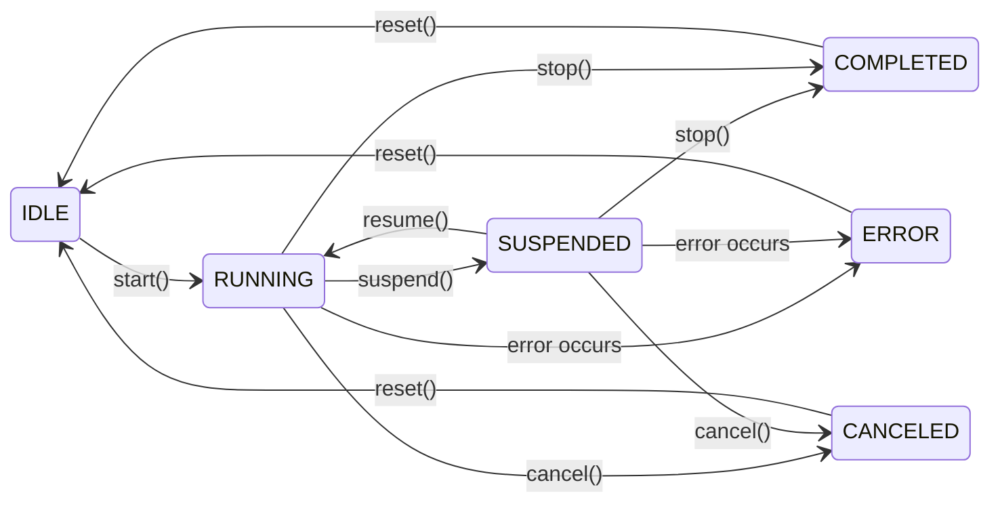

# CubeMelon プラグインシステム 仕様書
<div style="text-align: right;">
2025/09/04<br>
PLUGIN_SDK_VERSION 0.11.3
</div>

---

## 目次

1. [概要](#1-概要)
2. [基本データ構造](#2-基本データ構造)
3. [C ABI インターフェイス](#3-c-abi-インターフェイス)
4. [エントリポイント](#4-エントリポイント)
5. [文字列仕様](#5-文字列仕様)
6. [エラーハンドリング](#6-エラーハンドリング)
7. [メモリ管理](#7-メモリ管理)
8. [スレッド安全性](#8-スレッド安全性)
9. [実装例（Rust SDK）](#9-実装例rust-sdk)
10. [プラグイン相互連携](#10-プラグイン相互連携)
11. [バージョニングと互換性](#11-バージョニングと互換性)
12. [デバッグとロギング](#12-デバッグとロギング)
13. [実装負担軽減策](#13-実装負担軽減策)
14. [おわりに](#14-おわりに)

---

## 1. 概要

本プラグインシステムは、多様な機能を持つプラグインを動的にロードし、相互連携させることを目的とした拡張可能なアーキテクチャです。プラグインは C ABI を介して連携し、C、C++、Rust その他の言語で実装可能です。

[目次に戻る](#目次)

---

## 2. 基本データ構造

### 2.1 UUID (プラグインファイル識別子)

```c
typedef struct {
    uint8_t bytes[16];
} CubeMelonUUID;
```

- プラグインファイル（DLL/共有ライブラリ）を識別するための128ビットUUIDです。
- 同一ファイルから作成されたすべてのプラグインインスタンスは同じUUIDを共有し、ファイル間でのグローバルな一意性を保証します。

### 2.2 バージョン情報

```c
typedef struct {
    uint16_t major;    // メジャーバージョン
    uint8_t  minor;    // マイナーバージョン  
    uint8_t  patch;    // パッチバージョン
} CubeMelonVersion;
```

4バイト構造体でセマンティックバージョニングに対応します。

### 2.3 言語識別

```c
typedef struct CubeMelonLanguage {
    const char8_t* code; // UTF-8, NULL終端, BCP 47形式
} CubeMelonLanguage;
```

言語は、[BCP 47](https://www.rfc-editor.org/rfc/bcp/bcp47.txt) 準拠の UTF-8文字列 によって識別されます。

#### [例]
`en-US`, `ja-JP`, `zh-Hant-TW`, etc...

##### [補足]
- code はハイフン区切り・正規化済み（BCP 47準拠）の文字列でなければならない
- code はNULL終端文字列であること（最大255バイト、NULLを含む）
- 言語タグは大文字小文字を区別し、BCP 47の正規形（en-US, ja-JP, zh-Hant-TW）でなければならない
- 大文字小文字が異なる場合も不明な言語として扱われる
- 不明な言語は正規化済みであっても、すべて `en-US` にフォールバックされる
- ホストは言語設定情報を持ち、インターフェイスを通してプラグインに情報を提供する
- 将来的な拡張により、構造体にフィールドが追加されることがある

### 2.4 プラグインタイプ (64ビットフラグ)

```c
// プラグインタイプ (64ビットフラグ)
typedef uint64_t CubeMelonPluginType;

// 基本
static const uint64_t PLUGIN_TYPE_BASIC = 0; // 基本インターフェイスのみ

// 実行形態（基本機能）
static const uint64_t PLUGIN_TYPE_SINGLE_TASK        = 0x0000000000000001ULL; // 単発実行（同期）
static const uint64_t PLUGIN_TYPE_ASYNC_TASK         = 0x0000000000000002ULL; // 単発実行（非同期）
static const uint64_t PLUGIN_TYPE_RESIDENT           = 0x0000000000000004ULL; // 常駐自動実行
static const uint64_t PLUGIN_TYPE_STATE              = 0x0000000000000008ULL; // 状態管理
static const uint64_t PLUGIN_TYPE_MANAGER            = 0x0000000000000010ULL; // プラグイン管理

// データ処理
static const uint64_t PLUGIN_TYPE_DATA_INPUT         = 0x0000000000000020ULL; // データ入力
static const uint64_t PLUGIN_TYPE_DATA_OUTPUT        = 0x0000000000000040ULL; // データ出力

// ユーザーインターフェイス
static const uint64_t PLUGIN_TYPE_WINDOW             = 0x0000000000000080ULL; // ウィンドウ操作

// メディア処理
static const uint64_t PLUGIN_TYPE_IMAGE              = 0x0000000000000100ULL; // 画像処理
static const uint64_t PLUGIN_TYPE_AUDIO              = 0x0000000000000200ULL; // 音声処理
static const uint64_t PLUGIN_TYPE_VIDEO              = 0x0000000000000400ULL; // 映像処理

// ファイルシステム・ストレージ
static const uint64_t PLUGIN_TYPE_FILE_SYSTEM        = 0x0000000000000800ULL; // ローカルファイルシステム操作
static const uint64_t PLUGIN_TYPE_DATABASE           = 0x0000000000001000ULL; // データベース操作

// セキュリティ
static const uint64_t PLUGIN_TYPE_ENCRYPTION         = 0x0000000000002000ULL; // 暗号化処理

// ネットワーク通信
static const uint64_t PLUGIN_TYPE_HTTP_CLIENT        = 0x0000000000100000ULL; // HTTP/HTTPS クライアント
static const uint64_t PLUGIN_TYPE_HTTP_SERVER        = 0x0000000000200000ULL; // HTTP/HTTPS サーバー
static const uint64_t PLUGIN_TYPE_TCP_CLIENT         = 0x0000000000400000ULL; // TCP クライアント
static const uint64_t PLUGIN_TYPE_TCP_SERVER         = 0x0000000000800000ULL; // TCP サーバー
static const uint64_t PLUGIN_TYPE_UDP_SOCKET         = 0x0000000001000000ULL; // UDP 通信
static const uint64_t PLUGIN_TYPE_WEBSOCKET          = 0x0000000002000000ULL; // WebSocket 通信
static const uint64_t PLUGIN_TYPE_FILE_SHARING       = 0x0000000004000000ULL; // ファイル共有（SMB、AFP、NFS等）
static const uint64_t PLUGIN_TYPE_SERVICE_DISCOVERY  = 0x0000000008000000ULL; // サービス発見（Bonjour、UPnP等）

// 将来の拡張用（例）
static const uint64_t PLUGIN_TYPE_STREAMING          = 0x0000000010000000ULL; // ストリーミング（RTP、WebRTC等）
static const uint64_t PLUGIN_TYPE_MESSAGING          = 0x0000000020000000ULL; // メッセージング（MQTT、AMQP等）
static const uint64_t PLUGIN_TYPE_BLOCKCHAIN         = 0x0000000040000000ULL; // ブロックチェーン通信
static const uint64_t PLUGIN_TYPE_IOT                = 0x0000000080000000ULL; // IoT プロトコル（CoAP等）

// 32-62bit はユーザー定義領域として予約
static const uint64_t PLUGIN_TYPE_USER_DEFINED_START = 0x0000000100000000ULL; // 2^32
static const uint64_t PLUGIN_TYPE_USER_DEFINED_END   = 0x4000000000000000ULL; // 2^62

// SDK内部用（使用禁止）... 誤って使用すると無効なプラグインになる
static const uint64_t PLUGIN_TYPE_RESERVED = 0x8000000000000000ULL;
```

#### [使用例]

複数の機能を組み合わせ可能：

```c
// Webサーバープラグイン
CubeMelonPluginType web_server = 
    PLUGIN_TYPE_HTTP_SERVER |     // HTTPサーバー機能
    PLUGIN_TYPE_WEBSOCKET |       // WebSocket対応  
    PLUGIN_TYPE_FILE_SYSTEM;      // 静的ファイル配信

// IoTゲートウェイプラグイン  
CubeMelonPluginType iot_gateway = 
    PLUGIN_TYPE_IOT |             // IoTプロトコル
    PLUGIN_TYPE_ENCRYPTION |      // セキュリティ
    PLUGIN_TYPE_DATABASE;         // データ蓄積
```

### 2.5 プラグインの実行状態

```c
typedef enum {
    EXECUTION_STATUS_IDLE      = 0,  // アイドル・待機中
    EXECUTION_STATUS_RUNNING   = 1,  // 実行中
    EXECUTION_STATUS_SUSPENDED = 2,  // 一時停止中
    EXECUTION_STATUS_COMPLETED = 3,  // 完了
    EXECUTION_STATUS_ERROR     = 4,  // エラー
    EXECUTION_STATUS_CANCELLED = 5,  // キャンセル
} CubeMelonExecutionStatus;
```

### 2.6 プラグインが持つ状態の種類

```c
typedef enum {
    PLUGIN_STATE_SCOPE_LOCAL  = 0, // プラグイン自身の内部状態
    PLUGIN_STATE_SCOPE_HOST   = 1, // ホスト環境（言語設定、タイムゾーンなど）
    PLUGIN_STATE_SCOPE_SHARED = 2, // 他のプラグインと共有する状態（画像、履歴など）
} CubeMelonPluginStateScope;
```

### 2.7 スレッド要件

```c
typedef enum {
    THREAD_REQ_NO_REQUIREMENTS = 0,
    THREAD_REQ_UI_THREAD       = 1 << 0,    // UIスレッドでの実行必須
    THREAD_REQ_BACKGROUND      = 1 << 1,    // バックグラウンドスレッド推奨
    THREAD_REQ_HIGH_PRIORITY   = 1 << 2,    // 高優先度スレッド推奨
    THREAD_REQ_LOW_PRIORITY    = 1 << 3,    // 低優先度スレッド推奨
} CubeMelonThreadRequirements;
```

### 2.8 タスクの種類

```c
typedef enum {
    TASK_TYPE_NONE = 0,
    
    // 基本タスク（1-19）
    TASK_TYPE_GENERIC            = 1,
    TASK_TYPE_FILE_IO            = 2,
    TASK_TYPE_DATABASE           = 3,
    TASK_TYPE_COMPUTATION        = 4,
    TASK_TYPE_WINDOW             = 5,
    TASK_TYPE_IMAGE              = 6,          
    TASK_TYPE_AUDIO              = 7,
    TASK_TYPE_VIDEO              = 8,
    // 9-19: 将来の基本機能用

    // ネットワークタスク（20-39）
    TASK_TYPE_HTTP               = 20,
    TASK_TYPE_TCP                = 21,
    TASK_TYPE_UDP                = 22,
    TASK_TYPE_WEBSOCKET          = 23,
    TASK_TYPE_FILE_SHARING       = 24, // SMB等
    TASK_TYPE_SERVICE_DISCOVERY  = 25, // Bonjour等
    TASK_TYPE_GRPC               = 26,
    TASK_TYPE_MQTT               = 27,
    TASK_TYPE_GRAPHQL            = 28,
    // 29-39: 将来のネットワークプロトコル用

    // 拡張タスク（40-99）
    // プロジェクト固有の機能

    // ユーザー定義（100-65535）
    TASK_TYPE_USER_DEFINED_START = 100,
    TASK_TYPE_USER_DEFINED_END   = 65535,

} CubeMelonTaskType;
```

### 2.9 タスク構造体とコールバック関数

```c
// 実行するタスク情報をまとめた構造体
#pragma pack(push, 8)
typedef struct {
    const CubeMelonPlugin* caller;       // 呼び出し元プラグイン
    CubeMelonValue* input_data;          // 入力データ（呼び出し元管理）
    CubeMelonString input_json;          // 追加情報（json形式）
    CubeMelonTaskType task_type;         // タスクの種類
    const CubeMelonLanguage language;    // 呼び出し元の言語設定
    int64_t request_time_us;             // 呼び出し時刻（UTCマイクロ秒）
    int64_t timeout_us;                  // 非同期実行の際のタイムアウト時間（マイクロ秒）
    void* user_data;                     // アプリケーション固有データ用
    void* reserved[2];                   // 将来の拡張用
} CubeMelonTaskRequest;
#pragma pack(pop)
```

```c
// タスクの実行結果をまとめた構造体
#pragma pack(push, 8)
typedef struct {
    const CubeMelonPlugin* callee;       // 実行したプラグイン
    CubeMelonValue* output_data;         // 出力データ（プラグイン確保）
    CubeMelonString output_json;         // 追加情報（json形式）
    CubeMelonExecutionStatus status;     // 実行状態
    CubeMelonPluginErrorCode error_code; // エラーコード
    int64_t completion_time_us;          // 完了時刻（UTCマイクロ秒）
    double progress_ratio;               // 進捗割合 [0.0, 1.0]
    CubeMelonString progress_message;    // 進捗情報
    CubeMelonString progress_stage;      // 進捗メッセージ
    uint64_t estimated_remaining_us;     // 推定残り時間（マイクロ秒）
    void* reserved[2];                   // 将来の拡張用
} CubeMelonTaskResult;
#pragma pack(pop)
```

```c
// 非同期タスク用コールバック関数
typedef void (*CubeMelonTaskCallback)(
    CubeMelonTaskRequest* request,
    const CubeMelonTaskResult* result
);
```

```c
// 無効な時間表現の定義
#define CUBEMELON_TIMESTAMP_INVALID (-1LL)
```

#### ⚠️注意⚠️

- 使用しないフィールドには **必ず** NULLもしくは0を代入すること

##### [フィールドの詳細]
- `request_time_us`, `completed_time_us`: == 0 は 1970-01-01 00:00:00 (UTC) を意味する
- `progress_ratio`: < 0.0 の場合は進捗割合が不明、[0.0, 1.0]の範囲で進捗を表現
- `progress_message`: `request->language.code` で指定された言語でのメッセージ
- `progress_stage`: "downloading", "processing", "uploading", etc...
- `estimated_remaining_us`: == **-1** の場合は残り時間が不明

##### [時間の取り扱い]
- タスク開始時: `request_time_us` に現在時刻のUTCマイクロ秒を設定する
- タスク未完了時: `completion_time_us` に **-1** を設定する（無効値として扱う）
- タスク完了時: `completion_time_us` に完了時刻のUTCマイクロ秒を設定する
- 判定例: `if (result->completed_time_us > 0) { /* 完了済み */ }`

##### [エラー時の動作]

`status == EXECUTION_STATUS_ERROR` の場合：
- `error_code` にエラーの詳細
- `output_data` は通常空（部分的な結果がある場合は設定される場合もある）
- 進捗関連フィールドは最後の値を保持

### 2.10 プラグインの基本情報

```c
// 基本情報構造体
#pragma pack(push, 8)
typedef struct {
    CubeMelonUUID uuid;                  // プラグインのUUID
    CubeMelonVersion version;            // プラグインのバージョン
    CubeMelonPluginType supported_types; // サポート機能
    const CubeMelonString name;          // 指定言語での名前
    const CubeMelonString description;   // 指定言語での説明
} CubeMelonPluginBasicInfo;
#pragma pack(pop)
```

### 2.11 ホストが提供するサービス群

```c
// ホストが提供するサービス群
typedef struct {
    // ログ出力
    void (*log)(CubeMelonLogLevel level, const char8_t* plugin_name, const char8_t* message);

    // 言語情報取得
    CubeMelonLanguage (*get_system_language)(void);
    
    // ホストプラグインの機能にアクセス
    CubeMelonPluginErrorCode (*get_host_interface)(
        CubeMelonPluginType interface_type,
        uint32_t interface_version,
        const CubeMelonPlugin** plugin,
        const void** interface
    );

    // 将来的に他のホストサービスも追加可能
    // void (*get_system_time)(CubeMelonTime* out_time);
    // const char8_t* (*get_app_data_directory)(void);
} CubeMelonHostServices;
```

### 2.12 時間を扱う構造体

```c
#pragma pack(push, 8)
typedef struct {
    int32_t year;               // 年（1970-9999）
    uint8_t month;              // 月（1-12）
    uint8_t day;                // 日（1-31）
    uint8_t weekday;            // 曜日（0 == Sunday）
    uint8_t hour;               // 時（0-30）
    uint8_t minute;             // 分（0-59）
    uint8_t second;             // 秒（0-60）
    uint16_t millisecond;       // ミリ秒（0-999）
    uint16_t microsecond;       // マイクロ秒（0-999）
    int16_t utc_offset_minutes; // UTC からの時差（分）
    char8_t tz_name[32];        // UTF-8（NULL終端）
} CubeMelonTime;
#pragma pack(pop)
```

[目次に戻る](#目次)

---

## 3. C ABI インターフェイス

### 3.1 基本構造体

#### 3.1.1 安全なメモリ管理構造体

```c
// 文字列用
#pragma pack(push, 8)
typedef struct {
    const char8_t* str;
    void (*free_string)(const char8_t* str);
} CubeMelonString;
#pragma pack(pop)
```

```c
// UUID配列用  
#pragma pack(push, 8)
typedef struct {
    CubeMelonUUID* uuids;
    size_t count;
    void (*free_uuid_array)(CubeMelonUUID* uuids, size_t count);
} CubeMelonUUIDArray;
#pragma pack(pop)
```

```c
// 基本情報配列用
#pragma pack(push, 8)
typedef struct {
    CubeMelonPluginBasicInfo* infos;
    size_t count;
    void (*free_info_array)(CubeMelonPluginBasicInfo* infos, size_t count);
} CubeMelonPluginBasicInfoArray;
#pragma pack(pop)
```

```c
typedef enum {
    Null, Bool, Int, UInt, Float, Pointer, String, Buffer, Array,
    Custom = UINT32_MAX,
} CubeMelonValueTag;

typedef struct CubeMelonValue CubeMelonValue;

// 汎用的な階層データ構造体
#pragma pack(push, 8)
struct CubeMelonValue {
    CubeMelonValueTag tag;
    uint32_t reserved;
    union {
        void* pointer;
        union {
            bool      b; // boolean
            intptr_t  i; // integer
            uintptr_t u; // unsigned integer
            double    f; // float
        } number;
        struct {
            const char8_t* str;
        } string;
        struct {
            size_t count;
            const void* data;
        } buffer;
        struct {
            size_t count;
            const CubeMelonValue* items;
        } array;
    } data;
    void (*free_value)(CubeMelonValue* value);
};
#pragma pack(pop)
```

##### ⚠️注意⚠️
使い終わったメモリは使用者が **必ず** `free_*()` 関数を呼び出して解放すること

#### 3.1.2 プラグイン構造体

```c
typedef struct CubeMelonPlugin CubeMelonPlugin;
```

- `CubeMelonPlugin構造体` は不透明（opaque）型として定義
- 内部構造は外部から直接アクセス不可
- 安全性とカプセル化を保証

### 3.2 プラグインインターフェイス

`CubeMelonPlugin` の操作は専用のメソッドを通じて行います：

#### 3.2.1 基本インターフェイス

プラグインのインスタンスが生成されたとき、最初に取得すべきインターフェイスです。`get_plugin_interface()` C ABI 関数を通じて取得します。

```c
typedef struct {
    // 基本情報取得
    CubeMelonUUID (*get_uuid)(void);
    CubeMelonVersion (*get_version)(void);
    CubeMelonPluginType (*get_supported_types)(void);

    // スレッド安全性
    bool (*is_thread_safe)(void);
    CubeMelonThreadRequirements (*get_thread_requirements)(void);

    // インスタンス固有の情報
    const char8_t* (*get_name)(
        const CubeMelonPlugin* plugin,
        const CubeMelonLanguage language
    );
    const char8_t* (*get_description)(
        const CubeMelonPlugin* plugin,
        const CubeMelonLanguage language
    );

    // ライフサイクル管理
    CubeMelonPluginErrorCode (*initialize)(
        CubeMelonPlugin* plugin, 
        const CubeMelonHostServices* host_services
    );
    CubeMelonPluginErrorCode (*uninitialize)(
        CubeMelonPlugin* plugin
    );

} CubeMelonInterface;
```

##### [メソッドの安全性について]

- `initialize()`, `uninitialize()` メソッドは、**安全に複数回呼び出せる**必要があります。既に初期化済み/未初期化の状態で呼び出された場合は、適切なエラーコードを返してください。
###### [例]
```c
typedef struct {
    bool initialized;
    // その他のデータ...
} PluginData;
```
- 初期化時
```c
CubeMelonPluginErrorCode initialize(
    CubeMelonPlugin* plugin, 
    const CubeMelonHostServices* host_services
) {
    if (plugin == NULL) {
        return PLUGIN_ERROR_NULL_POINTER;
    }
    
    PluginData* data = (PluginData*)plugin;
    if (data->initialized) {
        // 既に初期化されている場合は何もせず制御を返す
        return PLUGIN_ERROR_ALREADY_INITIALIZED;
    }

    /* 初期化処理... */
    
    data->initialized = true; // 二重初期化防止

    return PLUGIN_SUCCESS;
}
```
- 終了処理時
```c
CubeMelonPluginErrorCode uninitialize(
    CubeMelonPlugin* plugin
) {
    if (plugin == NULL) {
        return PLUGIN_ERROR_NULL_POINTER;
    }
    
    PluginData* data = (PluginData*)plugin;
    if (!data->initialized) {
        // 既に未初期化の場合は何もせず制御を返す
        return PLUGIN_ERROR_NOT_INITIALIZED;
    }

    /* 終了処理... */
    
    data->initialized = false; // 二重終了防止
    
    return PLUGIN_SUCCESS;
}
```

### 3.3 標準インターフェイス

プラグインは `get_plugin_interface()` C ABI 関数を通じて、機能別インターフェイスを提供します。以下は標準的なインターフェイス定義です。

#### 3.3.1 単発実行インターフェイス（同期）

単一のタスクを実行します。実行は同期的に行われ、制御はタスク完了後に呼び出し元に返ります。

```c
typedef struct {
    // タスク実行（同期）
    // 呼び出し元が free_*() で解放
    CubeMelonPluginErrorCode (*execute)(
        CubeMelonPlugin* plugin,
        const CubeMelonTaskRequest* request,
        CubeMelonTaskResult* result
    );

} CubeMelonSingleTaskInterface;
```

##### [補足]
- `CubeMelonTaskRequest` オブジェクトおよび `CubeMelonTaskResult` オブジェクトは、呼び出し元が生成します。
- `CubeMelonTaskRequest` オブジェクトおよび `CubeMelonTaskResult` オブジェクトは、タスク実行終了後に制御が戻った後、呼び出し元が破棄します。

#### 3.3.2 単発実行インターフェイス（非同期）

単一のタスクを実行します。実行は非同期的に行われ、制御は直ちに呼び出し元に返ります。実行の結果を受け取るには、コールバック関数を使います。

```c
typedef struct {
    // タスク実行（非同期）
    CubeMelonPluginErrorCode (*execute)(
        CubeMelonPlugin* plugin,
        CubeMelonTaskRequest* request,
        CubeMelonTaskCallback callback
    );

    // 非同期実行のキャンセル
    // 呼び出し元が free_*() で解放
    CubeMelonPluginErrorCode (*cancel)(
        CubeMelonPlugin* plugin,
        CubeMelonTaskRequest* request
    );

} CubeMelonAsyncTaskInterface;
```

##### [補足]
- プラグイン側は、コールバック関数がNULLかどうかを確認しなければなりません。NULLの場合、結果は通知されません。
- `CubeMelonTaskRequest` オブジェクトは呼び出し元が生成し、コールバック関数内で破棄します。
- `CubeMelonTaskResult` オブジェクトはプラグイン側が生成し、コールバック関数が終わってプラグイン側に制御が戻った後、プラグイン側が破棄します。
- `cancel()` の 呼び出し元は、操作完了後に `CubeMelonTaskRequest` オブジェクトを破棄します。ただし、コールバック関数内で同じオブジェクトが二重に破棄されないよう、注意する必要があります。
- `cancel()` の呼び出し前に `CubeMelonTaskRequest` オブジェクトが既に破棄されていた場合、操作は無視されます。

#### 3.3.3 常駐実行インターフェイス

メモリに常駐し、設定に従ってタスクを自動実行します。設定はユーザー定義のJSON形式で行います。

```c
typedef struct {
    // サービスの状態を取得
    CubeMelonExecutionStatus (*get_status)(
        const CubeMelonPlugin* plugin
    );

    // 現在の設定取得
    const char8_t* (*get_configuration)(
        const CubeMelonPlugin* plugin
    );

    // 実行中の設定変更
    CubeMelonPluginErrorCode (*update_configuration)(
        CubeMelonPlugin* plugin,
        const char8_t* config_json
    );
    
    // サービスを開始
    // 成功時: IDLE -> RUNNING
    // EXECUTION_STATUS_IDLE でないときはエラー
    CubeMelonPluginErrorCode (*start)(
        CubeMelonPlugin* plugin,
        const char8_t* config_json
    );
    
    // サービスを中断
    // 成功時: RUNNING -> SUSPENDED
    // EXECUTION_STATUS_RUNNING でないときはエラー
    CubeMelonPluginErrorCode (*suspend)(
        CubeMelonPlugin* plugin
    );

    // サービスを再開
    // EXECUTION_STATUS_SUSPENDED でないときはエラー
    CubeMelonPluginErrorCode (*resume)(
        CubeMelonPlugin* plugin
    );

    // サービスを終了
    CubeMelonPluginErrorCode (*stop)(
        CubeMelonPlugin* plugin
    );

    // 初期状態に戻る
    // EXECUTION_STATUS_COMPLETED または EXECUTION_STATUS_ERROR でないときはエラー
    CubeMelonPluginErrorCode (*reset)(
        CubeMelonPlugin* plugin
    );

} CubeMelonResidentInterface;
```

##### [状態遷移表]
| 関数 | 呼び出し可能な状態 | 遷移後の状態 | 備考 | 
|---|---|---|---|
| start() | IDLE | RUNNING | 初期データあり | 
| suspend() | RUNNING | SUSPENDED | 一時停止 | 
| resume() | SUSPENDED | RUNNING | 再開 | 
| stop() | RUNNING, SUSPENDED | COMPLETED | 終了処理 | 
| cancel()* | RUNNING, SUSPENDED | CANCELED | キャンセル状態 |
| reset() | COMPLETED, ERROR, CANCELED | IDLE | 再利用可能に | 

##### [状態遷移図]


*`cancel()` は `CubeMelonResidentInterface` のメソッドではないが、ここでは状態遷移を網羅するためにあえて表記

#### 3.3.4 状態管理インターフェイス

プラグインの状態を保持し、データの永続化や他プラグインへの供給をサポートします。

```c
typedef struct {
    // 状態データの保存・復元
    // 呼び出し元がdataを作成し、プラグインがdata内容を設定、data.free_value()で内容を解放
    CubeMelonPluginErrorCode (*load_state)(
        CubeMelonPlugin* plugin,
        CubeMelonPluginStateScope scope,
        CubeMelonValue* data
    );
    CubeMelonPluginErrorCode (*save_state)(
        CubeMelonPlugin* plugin,
        CubeMelonPluginStateScope scope,
        const void* data,
        size_t size
    );

    // 状態データの形式名を取得する
    // 例："json", "toml", "msgpack"...
    const char8_t* (*get_format_name)(
        const CubeMelonPlugin* plugin,
        CubeMelonPluginStateScope scope
    );

    // 特定のキーに対応する状態データの設定・取得
    // 呼び出し元がvalueを作成し、プラグインがvalue内容を設定、value.free_value()で内容を解放
    CubeMelonPluginErrorCode (*get_state_value)(
        const CubeMelonPlugin* plugin,
        CubeMelonPluginStateScope scope,
        const char8_t* key,
        CubeMelonValue* value
    );
    CubeMelonPluginErrorCode (*set_state_value)(
        CubeMelonPlugin* plugin,
        CubeMelonPluginStateScope scope, 
        const char8_t* key,
        const void* data,
        size_t size
    );
    
    // 状態データの一覧と数を取得
    // 呼び出し元がkeysを作成し、プラグインがkeys内容を設定、keys.free_value()で内容を解放
    CubeMelonPluginErrorCode (*list_state_keys)(
        const CubeMelonPlugin* plugin,
        CubeMelonPluginStateScope scope,
        CubeMelonValue* keys
    );

    // 特定のキーに対応する状態データを削除する
    CubeMelonPluginErrorCode (*clear_state_value)(
        CubeMelonPlugin* plugin,
        CubeMelonPluginStateScope scope,
        const char8_t* key
    );

} CubeMelonPluginStateInterface;
```

#### 3.3.5 プラグイン管理インターフェイス

読み込まれたプラグインを管理し、プラグインをまたいだタスクの実行を仲介します。

```c
typedef struct {
    // 全プラグインの基本情報一括取得（UI向け）
    // 呼び出し元が out_infos.free_array() で解放
    CubeMelonPluginErrorCode (*get_all_plugins_basic_info)(
        const CubeMelonPlugin* plugin,
        const CubeMelonLanguage language,
        CubeMelonPluginBasicInfoArray* out_infos
    );

    // 単一プラグインの詳細情報（JSON形式、拡張情報含む）
    // 呼び出し元が out_detailed_json.free_stirng() で解放
    CubeMelonPluginErrorCode (*get_plugin_detailed_info)(
        const CubeMelonPlugin* plugin,
        CubeMelonUUID target_uuid,
        const CubeMelonLanguage language,
        CubeMelonString* out_detailed_json
    );

    // 機能検索（階層全体から検索）
    // 呼び出し元が out_uuids.free_array() で解放
    CubeMelonPluginErrorCode (*find_plugins_for_task)(
        const CubeMelonPlugin* plugin, 
        const char8_t* task_json, 
        CubeMelonUUIDArray* out_uuids
    );

    // プラグインの生存確認
    bool (*is_plugin_alive)(
        const CubeMelonPlugin* plugin,
        CubeMelonUUID target_uuid
    );

    // 同期タスク実行
    CubeMelonPluginErrorCode (*execute_task)(
        CubeMelonPlugin* plugin,
        CubeMelonUUID target_uuid,
        const CubeMelonTaskRequest* request,
        CubeMelonTaskResult* result
    );

    // 非同期タスク実行
    CubeMelonPluginErrorCode (*execute_async_task)(
        CubeMelonPlugin* plugin,
        CubeMelonUUID target_uuid,
        CubeMelonTaskRequest* request,
        CubeMelonTaskCallback callback
    );

    // 非同期タスクのキャンセル
    CubeMelonPluginErrorCode (*cancel_async_task)(
        CubeMelonPlugin* plugin,
        CubeMelonTaskRequest* request
    );

} CubeMelonPluginManagerInterface;
```

##### [補足]
- プラグイン側は、コールバック関数がNULLかどうかを確認しなければなりません。NULLの場合、結果は通知されません。
- `execute_task()` では `CubeMelonTaskRequest` オブジェクトおよび `CubeMelonTaskResult` オブジェクトは呼び出し元が生成し、呼び出し元が破棄します。
- `execute_async_task()` では `CubeMelonTaskRequest` オブジェクトは呼び出し元が生成し、コールバック関数内で破棄します。 `CubeMelonTaskResult` オブジェクトはプラグイン側が生成し、コールバック関数が終わってプラグイン側に制御が戻った後、プラグイン側が破棄します。
- `cancel_async_task()` の 呼び出し元は、操作完了後に `CubeMelonTaskRequest` オブジェクトを破棄します。ただし、コールバック関数内で同じオブジェクトが二重に破棄されないよう、注意する必要があります。
- `cancel_async_task()` の呼び出し前に `CubeMelonTaskRequest` オブジェクトが既に破棄されていた場合、操作は無視されます。

#### 3.3.6 データ入力インターフェイス

データの読み込みをサポートします。

```c
typedef struct {
    // ファイル読み込み
    // 呼び出し元がdataを作成し、プラグインがdata内容を設定、data.free_value()で内容を解放
    CubeMelonPluginErrorCode (*read_file)(
        CubeMelonPlugin* plugin,
        const char8_t* filepath,
        CubeMelonValue* data
    );
    
    // ストリーム読み込み
    CubeMelonPluginErrorCode (*open_stream)(
        CubeMelonPlugin* plugin,
        const void* source,
        int* stream_id
    );
    // 呼び出し元がdataを作成し、プラグインがdata内容を設定、data.free_value()で内容を解放
    CubeMelonPluginErrorCode (*read_stream)(
        CubeMelonPlugin* plugin,
        int stream_id,
        size_t size,
        CubeMelonValue* data
    );
    void (*close_stream)(
        CubeMelonPlugin* plugin,
        int stream_id
    );
    
    // サポートフォーマット確認
    bool (*supports_format)(
        const CubeMelonPlugin* plugin,
        const char8_t* format
    );
    // 呼び出し元が supported_formats を作成、プラグインが内容を設定、呼び出し元が supported_formats->free_value() で内容を解放
    CubeMelonPluginErrorCode (*get_supported_formats)(
        const CubeMelonPlugin* plugin,
        CubeMelonValue* supported_formats
    );

} CubeMelonDataInputInterface;
```

#### 3.3.7 データ出力インターフェイス

データの書き出しをサポートします。

```c
typedef struct {
    // ファイル書き込み
    CubeMelonPluginErrorCode (*write_file)(
        CubeMelonPlugin* plugin,
        const char8_t* filepath,
        const void* data,
        size_t size
    );
    
    // ストリーム書き込み
    CubeMelonPluginErrorCode (*open_stream)(
        CubeMelonPlugin* plugin,
        const char8_t* destination,
        int* stream_id
    );
    CubeMelonPluginErrorCode (*write_stream)(
        CubeMelonPlugin* plugin,
        int stream_id,
        const void* data,
        size_t size
    );
    void (*close_stream)(
        CubeMelonPlugin* plugin,
        int stream_id
    );
    
    // フォーマット変換
    // input_dataは呼び出し元が配列を作成して内容も設定
    // output_dataは呼び出し元が作成、プラグインが内容を設定、呼び出し元が output_data->free_value() で内容を解放
    CubeMelonPluginErrorCode (*convert_format)(
        CubeMelonPlugin* plugin,
        const char8_t* input_format,
        const CubeMelonValue* input_data,
        const char8_t* output_format,
        CubeMelonValue* output_data
    );

} CubeMelonDataOutputInterface;
```

#### 3.3.8 ウィンドウインターフェイス

ウィンドウを操作するインターフェイスを提供します。

```c
typedef struct {
    // ウィンドウ管理
    CubeMelonPluginErrorCode (*create_window)(
        CubeMelonPlugin* plugin,
        const char8_t* title,
        int width,
        int height,
        int* window_id
    );
    void (*show_window)(
        CubeMelonPlugin* plugin,
        int window_id
    );
    void (*hide_window)(
        CubeMelonPlugin* plugin,
        int window_id
    );
    void (*close_window)(
        CubeMelonPlugin* plugin,
        int window_id
    );
    void (*destroy_window)(
        CubeMelonPlugin* plugin,
        int window_id
    );
    
    // イベント処理
    void (*set_event_callback)(
        CubeMelonPlugin* plugin,
        int window_id, 
        void (*callback)(int event_type, void* event_data)
    );
    
    // レンダリング
    // 戻り値はシステムリソース、呼び出し元は解放してはいけない
    const void* (*get_render_context)(
        CubeMelonPlugin* plugin,
        int window_id
    );
    void (*present)(
        CubeMelonPlugin* plugin,
        int window_id
    );

} CubeMelonWindowInterface;
```

### 3.4 拡張インターフェイス

#### 3.4.1 HTTPクライアントインターフェイス

HTTP/HTTPSクライアント通信をサポートします。

```c
typedef struct {
    // HTTP/HTTPS通信
    CubeMelonPluginErrorCode (*send_request)(
        CubeMelonPlugin* plugin,
        const CubeMelonTaskRequest* request,
        CubeMelonTaskCallback callback
    );

    // 通信キャンセル
    CubeMelonPluginErrorCode (*cancel_request)(
        CubeMelonPlugin* plugin,
        CubeMelonTaskRequest* request
    );
  
    // 設定
    void (*set_timeout)(
        CubeMelonPlugin* plugin,
        uint32_t timeout_ms
    );
    void (*set_user_agent)(
        CubeMelonPlugin* plugin,
        const char8_t* user_agent
    );

} CubeMelonHttpClientInterface;
```

#### 3.4.2 さらなる拡張インターフェイス

さらなる拡張インターフェイスについては、APIドキュメントをお読みください。

[目次に戻る](#目次)

---

## 4. エントリポイント

### 4.1 必須エクスポート関数

.dll (Windows)、.so (Linux)、.dylib (macOS) などのプラグインファイルは、以下の関数を外部に公開します：

```c
// プラグイン情報取得（プラグイン作成前に呼び出し可能）
CubeMelonVersion    get_plugin_sdk_version(void);     // プラグインのSDKバージョン
CubeMelonUUID       get_plugin_uuid(void);            // プラグインのUUID
CubeMelonVersion    get_plugin_version(void);         // プラグイン自身のバージョン
CubeMelonPluginType get_plugin_supported_types(void); // プラグインタイプ

// プラグイン作成
CubeMelonPlugin* create_plugin(void);

// プラグインのインターフェイスを取得
CubeMelonPluginErrorCode get_plugin_interface(
    CubeMelonPluginType plugin_types,
    uint32_t interface_version,
    const void** interface
);

// プラグイン破棄
void destroy_plugin(CubeMelonPlugin* plugin);

// プラグインファイルをアンロードしてよいか
bool can_unload_now(void);
```
これらの関数を外部公開していない場合、有効なプラグインとして読み込まれません。

### 4.2 Windows 環境固有の対応

#### 4.2.1 DEFファイルの作成

Windows で DLLファイルを作成するときは、以下のようなDEFファイルが必要です：

```
EXPORTS
    get_plugin_sdk_version     @1
    get_plugin_uuid            @2
    get_plugin_version         @3
    get_plugin_supported_types @4
    create_plugin              @5
    get_plugin_interface       @6
    destroy_plugin             @7
    can_unload_now             @8
```

DEFファイルはプレーンなテキストファイルです。UTF-8のほか、ANSI、UTF-16でもエンコードできますが、UTF-8を使用することをおすすめします。
ファイルの名前は任意ですが、ここでは exports.def とします。

##### ⚠️警告⚠️

- DEFファイルを使用せず、`__declspec(dllexport)` を使った場合の ABI は保証されません。

#### 4.2.2 build.rs の作成

Rust でプラグインを開発する場合は、以下の build.rs ファイルを作成してください。

```rust
fn main() {
    // ❌ 相対パスは危険
    // println!("cargo:rustc-link-arg=/DEF:exports.def");

    // ✅ 絶対パスを使用
    if cfg!(target_os = "windows") {
        let manifest_dir = std::env::var("CARGO_MANIFEST_DIR").unwrap();
        let def_path = std::path::Path::new(&manifest_dir).join("exports.def");
        println!("cargo:rustc-link-arg=/DEF:{}", def_path.display());
    }
}
```

以下のように配置します：

```
your_project/
├── Cargo.toml
├── build.rs    *
├── exports.def *
├── src/
│  ├── lib.rs
│  └── ...
└── ...
```

##### [重要]
- 相対パスでの指定は、実行ディレクトリによって失敗する可能性があります。必ず CARGO_MANIFEST_DIR を使用して絶対パスを構築してください。
- 上記理由により、exports.def の位置はプロジェクトのルートフォルダに置いてください。
- build.rs は**必ず**プロジェクトのルートフォルダに置いてください。

### 4.3 使用上の注意事項

#### 4.3.1 プラグインインターフェイスの安全な使用

##### ⚠️重要な警告⚠️

プラグインインターフェイスは、そのインターフェイスを取得したプラグインに対してのみ使用してください。

```c
// ❌ 危険な使用例

typedef CubeMelonPlugin* (*CREATE_PLUGIN_FN)();
CREATE_PLUGIN_FN create_plugin;

create_plugin = (CREATE_PLUGIN_FN)dlsym(handle_A, "create_plugin");
CubeMelonPlugin* plugin_A = create_plugin(); // プラグインA の instance

create_plugin = (CREATE_PLUGIN_FN)dlsym(handle_B, "create_plugin");
CubeMelonPlugin* plugin_B = create_plugin(); // プラグインB の instance

const CubeMelonInterface* interface_A = NULL;
get_plugin_interface(PLUGIN_TYPE_XXX, 1, (const void**)&interface_A); // プラグインA の interface

// ❌ これは未定義動作を引き起こします
interface_A->get_name(plugin_B, LANGUAGE_EN_US); // ❌ plugin_A の interface で plugin_B にアクセス

// ✅ 正しい使用例
interface_A->get_name(plugin_A, LANGUAGE_EN_US); // ✅ 同じプラグインの interface と instance を使用
```

#### 4.3.2 プラグインファイルの安全な解放

- ホストはプラグインファイルをアンロードする前に、 `can_unload_now()` 関数を呼び出してアンロード可能かを問い合わせます。
- プラグインは、まだ生存中のインスタンスがある場合、`false` を返してアンロードを拒否します。
- ホストは `can_unload_now()` 関数が `true` を返すまで、プラグインファイルを**アンロードしてはいけません**。
- 複数スレッドでインスタンスを扱う場合は、競合状態を避けるため、必ず `can_unload_now()` 関数で確認してください。

[目次に戻る](#目次)

---

## 5. 文字列仕様

### 5.1 エンコーディング

1. すべての文字列は UTF-8 エンコーディングを使用
2. NULL終端必須
3. 文字列の長さ制限は特に設けないが、実装時は適切なバッファサイズを確保

### 5.2 多言語対応

```c
// 使用例
const char8_t* name_1 = interface->get_name(plugin, LANGUAGE_JA_JP); // "プラグイン名"
const char8_t* name_2 = interface->get_name(plugin, LANGUAGE_EN_US); // "Plugin Name"
```

プラグインは要求された言語での文字列を返します。対応していない言語の場合は英語（LANGUAGE_EN_US）にフォールバックします。

#### [必須]
- 全プラグインは少なくとも、英語（LANGUAGE_EN_US）での名称・説明を**必ず**実装しなければなりません。

[目次に戻る](#目次)

---

## 6. エラーハンドリング

### 6.1 戻り値規則

#### 6.1.1 エラーコードの定義

```c
// 成功: 0, 失敗: 負の値, 情報: 正の値
typedef enum {
    // 成功
    PLUGIN_SUCCESS = 0,
    
    // 一般的なエラー (-1 ~ -19)
    PLUGIN_ERROR_UNKNOWN                 = -1,   // 不明なエラー
    PLUGIN_ERROR_INVALID_PARAMETER       = -2,   // 無効なパラメータ
    PLUGIN_ERROR_NOT_SUPPORTED           = -3,   // サポートされていない操作
    PLUGIN_ERROR_MEMORY_ALLOCATION       = -4,   // メモリ割り当て失敗
    PLUGIN_ERROR_NULL_POINTER            = -5,   // NULLポインタエラー
    PLUGIN_ERROR_OUT_OF_BOUNDS           = -6,   // 範囲外アクセス
    PLUGIN_ERROR_INVALID_STATE           = -7,   // 無効な状態
    PLUGIN_ERROR_PERMISSION_DENIED       = -8,   // アクセス権限なし
    PLUGIN_ERROR_RESOURCE_BUSY           = -9,   // リソースが使用中
    PLUGIN_ERROR_RESOURCE_EXHAUSTED      = -10,  // リソース枯渇
    
    // 初期化関連 (-20 ~ -29)
    PLUGIN_ERROR_INITIALIZATION_FAILED   = -20,  // 初期化失敗
    PLUGIN_ERROR_ALREADY_INITIALIZED     = -21,  // 既に初期化済み
    PLUGIN_ERROR_NOT_INITIALIZED         = -22,  // 未初期化
    PLUGIN_ERROR_VERSION_MISMATCH        = -23,  // バージョン不一致
    PLUGIN_ERROR_INCOMPATIBLE            = -24,  // 互換性なし
    
    // プラグイン・インターフェイス関連 (-30 ~ -39)
    PLUGIN_ERROR_PLUGIN_NOT_FOUND        = -30,  // プラグインが見つからない
    PLUGIN_ERROR_INTERFACE_NOT_SUPPORTED = -31,  // インターフェイスがサポートされていない
    PLUGIN_ERROR_NOT_IMPLEMENTED         = -32,  // 実装されていない
    PLUGIN_ERROR_PLUGIN_LOAD_FAILED      = -33,  // プラグインのロード失敗
    PLUGIN_ERROR_PLUGIN_UNLOAD_FAILED    = -34,  // プラグインのアンロード失敗
    
    // 通信・I/O関連 (-40 ~ -49)
    PLUGIN_ERROR_CONNECTION_FAILED       = -40,  // 接続失敗
    PLUGIN_ERROR_TIMEOUT                 = -41,  // タイムアウト
    PLUGIN_ERROR_IO                      = -42,  // I/Oエラー
    PLUGIN_ERROR_NETWORK                 = -43,  // ネットワークエラー
    PLUGIN_ERROR_CANCELLED               = -44,  // 操作がキャンセルされた
    
    // データ・解析関連 (-50 ~ -59)
    PLUGIN_ERROR_PARSE                   = -50,  // パースエラー
    PLUGIN_ERROR_VALIDATION              = -51,  // 検証エラー
    PLUGIN_ERROR_ENCODING                = -52,  // エンコーディングエラー
    PLUGIN_ERROR_DATA_CORRUPTED          = -53,  // データ破損
    PLUGIN_ERROR_FORMAT_UNSUPPORTED      = -54,  // フォーマット非対応
    
    // 同期・並行性関連 (-60 ~ -69)
    PLUGIN_ERROR_LOCK_FAILED             = -60,  // ロック取得失敗
    PLUGIN_ERROR_DEADLOCK                = -61,  // デッドロック検出
    PLUGIN_ERROR_STATE                   = -62,  // 状態管理エラー（RwLock等）
    PLUGIN_ERROR_THREAD_PANIC            = -63,  // スレッドパニック
    
    // ファイルシステム関連 (-70 ~ -79)
    PLUGIN_ERROR_FILE_NOT_FOUND          = -70,  // ファイルが見つからない
    PLUGIN_ERROR_FILE_EXISTS             = -71,  // ファイルが既に存在
    PLUGIN_ERROR_DIRECTORY_NOT_EMPTY     = -72,  // ディレクトリが空でない
    PLUGIN_ERROR_DISK_FULL               = -73,  // ディスク容量不足
    
    // 将来の拡張用に予約
    PLUGIN_ERROR_RESERVED_START          = -100, // この範囲のデータを
    PLUGIN_ERROR_RESERVED_END            = -999, // 受け取った場合は無視される

} CubeMelonPluginErrorCode;
```

#### 6.1.2 エラー時の戻り値ルール

- **成功**: PLUGIN_SUCCESS
- **失敗**: 対応するエラーコード
- **out パラメータ**: エラー時はNULLまたは0で初期化

### 6.2 エラー情報取得

各プラグインのメソッドは`CubeMelonPluginErrorCode`を直接返すため、エラー情報の取得が簡潔です。

#### 6.2.1 基本的なエラーハンドリング

```c
// エラーコードを直接取得
CubeMelonPluginErrorCode error = interface->read_file(plugin, filepath, &data, &size);
if (error != PLUGIN_SUCCESS) {
    // エラーハンドリング
    handle_error(error);
}
```

#### 6.2.2 SDK提供のヘルパー関数

SDKはエラーコードを人間が読める文字列に変換する関数を提供します：

```c
// SDK提供のヘルパー関数
const char8_t* plugin_error_code_to_string(CubeMelonPluginErrorCode code, const CubeMelonLanguage language);
```

#### 6.2.3 使用例

```c
// エラーハンドリングの基本パターン
CubeMelonTaskRequest request = {
    .caller = plugin,
    .task_type = TASK_TYPE_HTTP,
    .input_json = {.str = "{\"method\":\"GET\",\"url\":\"https://api.example.com\"}", ...},
    // ...
};
CubeMelonPluginErrorCode result = http_interface->send_request(plugin, &request, callback);

if (result != PLUGIN_SUCCESS) {
    // エラーメッセージを取得
    const char8_t* error_message = plugin_error_code_to_string(result, LANGUAGE_EN_US);
    
    // ログ出力（ホストサービス経由）
    host_services->log(LOG_LEVEL_ERROR, "MyPlugin", error_message);
    
    // エラーの種類に応じた処理
    switch (result) {
        case PLUGIN_ERROR_NETWORK:
            retry_connection();
            break;
        case PLUGIN_ERROR_TIMEOUT:
            increase_timeout_and_retry();
            break;
        default:
            abort_operation();
            break;
    }
}
```

プラグイン実装者は戻り値を確認し、適切なエラーハンドリングを行うことが重要です。

[目次に戻る](#目次)

---

## 7. メモリ管理

### 7.1 基本原則

1. **呼び出し先確保・呼び出し先解放**: プラグインが確保したメモリはプラグイン側で解放
2. **一貫性**: 文字列やバッファを返すすべてのメソッドは、対応する解放メソッドを提供
3. **有効期間**: 解放不要の戻り値は、プラグインがアンロードされるまで、または同一インスタンスから同一メソッドが次回呼び出されるまで有効

### 7.2 文字列とバッファの管理

```c
// プラグインが文字列を返す場合の典型例
CubeMelonString string;
if (interface->some_function_returning_string(plugin, &string) == PLUGIN_SUCCESS) {
    // 結果を使用
    printf("Result: %s\n", string.str);
    
    // 必ず解放
    if (string.free_string != NULL)
    {
        string.free_string(string.str);
        string.str = NULL; // 必ず NULL でクリアする
    }
}

// バッファを返す場合
CubeMelonValue value;
if (interface->some_function_returning_buffer(plugin, &value) == PLUGIN_SUCCESS) {
    // データを使用
    process_data(value.buffer.data, value.buffer.size);

    // 必ず解放
    if (value.free_value != NULL)
    {
        value.free_value(value);
        value.buffer.data = NULL; // 必ず NULL でクリアする
        value.buffer.size = 0;    // 必ず 0 でクリアする
        value.free_value  = NULL; // 必ず NULL でクリアする
    }
}
```

#### 7.2.1 NULLチェック

- `free_*()` 関数を呼び出す前にNULLチェックを行う
- `free_*()` 関数がNULLの場合は解放の必要なし
- 解放後は二重解放やダングリングポインタ防止のため、**必ず** NULLまたは0を代入しておく

#### 7.2.2 スレッド安全性

- 一つのCubeMelonString/CubeMelonValueオブジェクトを複数スレッドで同時に使用してはならない
- `free_*()` 関数は該当オブジェクトを取得したスレッドで呼び出すこと
- エラー時のoutパラメータは NULLまたは0で初期化される

[目次に戻る](#目次)

---

## 8. スレッド安全性

### 8.1 基本方針

1. プラグインの実装は基本的にスレッドセーフである必要がある
2. 単一スレッドでの動作のみをサポートするプラグインは明示的に示す
3. ホスト側は異なるスレッドから同一プラグインのメソッドを呼び出す可能性がある

### 8.2 スレッド情報取得

```c
// CubeMelonInterface のメソッド
bool (*is_thread_safe)(void);
CubeMelonThreadRequirements (*get_thread_requirements)(void); // ビットフラグ
```

#### スレッド安全性の解釈

| is_thread_safe() | get_thread_requirements() | 意味 |
|------------------|---------------------------|------|
| true | 0 (フラグなし) | 完全にスレッドセーフ、どのスレッドからでも呼び出し可能 |
| true | THREAD_REQ_UI_THREAD | スレッドセーフだが、UIリソースにアクセスするためUIスレッドで実行すべき |
| true | THREAD_REQ_BACKGROUND | スレッドセーフで、バックグラウンドスレッドでの実行を推奨（重い処理など） |
| true | THREAD_REQ_HIGH_PRIORITY | スレッドセーフで、高優先度での実行を推奨（リアルタイム処理など） |
| false | 0 (フラグなし) | スレッドセーフでない、ホストは排他制御が必要 |
| false | THREAD_REQ_UI_THREAD | スレッドセーフでなく、かつUIスレッドでの実行が必要 |

#### 注意事項

- `get_thread_requirements()` の値は実行環境のヒントであり、強制ではない
- `is_thread_safe()` が false の場合、ホストは同一インスタンスへの同時アクセスを防ぐ責任がある
- 複数のフラグを組み合わせることも可能（例：THREAD_REQ_BACKGROUND | THREAD_REQ_HIGH_PRIORITY）

[目次に戻る](#目次)

---

## 9. 実装例（Rust SDK）

### 9.1 基本プラグイン

```rust
use cubemelon_sdk::prelude::*;

#[plugin]
pub struct MyPlugin {
}

#[plugin_impl]
impl MyPlugin {
    pub fn new() -> Self { Self {} }
    pub fn get_uuid() -> CubeMelonUUID { uuid!("12345678-1234-5678-9abc-123456789abc") }
    pub fn get_version() -> CubeMelonVersion { version!(1, 0, 0) }
    pub fn get_supported_types() -> u64 { CubeMelonPluginType::Basic as u64 }
}

#[plugin_interface(basic)]
impl SimplePlugin {}
```

### 9.2 単発実行プラグイン

```rust
use cubemelon_sdk::prelude::*;

#[plugin]
pub struct MyPlugin {
    initialized: bool,
}

#[plugin_impl]
impl MyPlugin {
    pub fn new() -> Self { Self { initialized: false, } }
    pub fn get_uuid() -> CubeMelonUUID { uuid!("12345678-1234-5678-9abc-123456789abc") }
    pub fn get_version() -> CubeMelonVersion { version!(1, 0, 0) }
    pub fn get_supported_types() -> u64 { CubeMelonPluginType::SingleTask as u64 }

    pub fn get_name(&self, language: CubeMelonLanguage) -> *const u8 {
        multilang_map!(language, "Single Task Plugin", {
            "ja-JP" => "単発実行プラグイン",
        })
    }

    pub fn get_description(&self, language: CubeMelonLanguage) -> *const u8 {
        multilang_map!(language, "Plugin that executes a single task.", {
            "ja-JP" => "単一のタスクを実行するプラグインです。",
        })
    }

    pub fn initialize(
        &mut self,
        _host_services: Option<&CubeMelonHostServices>,
    ) -> Result<(), CubeMelonPluginErrorCode> {
        if self.initialized {
            return Err(CubeMelonPluginErrorCode::AlreadyInitialized);
        }
        self.initialized = true;
        Ok(())
    }

    pub fn uninitialize(&mut self) -> Result<(), CubeMelonPluginErrorCode> {
        if !self.initialized {
            return Err(CubeMelonPluginErrorCode::NotInitialized);
        }
        self.initialized = false;
        Ok(())
    }
}

#[single_task_plugin_impl]
impl MyPlugin {
    pub fn execute(
        &mut self,
        _request: &CubeMelonTaskRequest,
        _result: &mut CubeMelonTaskResult,
    ) -> CubeMelonPluginErrorCode {
        CubeMelonPluginErrorCode::Success
    }
}

#[plugin_interface(single_task)]
impl Plugin {}
```

[目次に戻る](#目次)

---

## 10. プラグイン相互連携

### 10.1 連携アーキテクチャ

1. **プログラム本体**: プラグイン管理プラグインとしての実装を持つ
2. **初期化時連携**: プラグインは`initialize()`時に親プラグインのハンドルを受け取る
3. **動的検索**: 必要な機能を持つプラグインを親プラグインに検索依頼
4. **柔軟な選択**: 複数候補がある場合の選択ルールを指定可能

### 10.2 タスクリクエスト形式（JSON）

タスクの依頼は拡張可能なJSON文字列で行います：

```json
{
    "action": "network.http_get",
    "category": "network",
    "input_format": "text/plain",
    "output_format": "application/json", 
    "parameters": {
        "url": "https://api.example.com",
        "timeout": 5000,
        "headers": {
            "User-Agent": "MyApp/1.0"
        }
    },
    "constraints": {
        "max_memory_mb": 100,
        "prefer_async": true
    },
    "priority": 1
}
```

詳しくはAPIドキュメントをお読みください。

### 10.3 実装例（SDK使用）* (TODO: サンプルコード修正)

```rust
use cubemelon_sdk::prelude::*;

// プラグイン実装側
#[plugin_impl] 
impl MyDataProcessor {
    pub fn initialize(
        &mut self,
        host_services: Option<&CubeMelonHostServices>
    ) -> Result<(), CubeMelonPluginErrorCode> {
        if let Some(services) = host_services {
            self.host_services = Some(*services);
        }
        Ok(())
    }
}

#[data_plugin_impl]
impl MyDataProcessor {
    pub fn process_data(&self, input: &[u8]) -> Result<String, CubeMelonPluginErrorCode> {
        // HTTPプラグインにHTTP POSTを依頼
        let task_json = r#"{
            "action": "network.http_post",
            "parameters": {
                "url": "https://api.example.com/process",
                "data": "base64encodeddata"
            }
        }"#;
        
        if let Some(ref services) = self.host_services {
            if let Ok((plugin, manager)) = services.get_host_interface(CubeMelonPluginType::Manager, 1) {
                // 適切なプラグインを見つけてタスク実行
                let target_uuid = manager.find_plugin_for_task(task_json)?;
                manager.execute_task_on_plugin(target_uuid, task_json)
            };
        }
    }
}

// シンプルな使用例
#[plugin_impl]
impl MyUtilityPlugin {
    pub fn encode_data(&self, data: &str) -> Result<String, CubeMelonPluginErrorCode> {
        let manager = self.manager.as_ref()
            .ok_or(CubeMelonPluginErrorCode::NOT_INITIALIZED)?;
            
        let task = format!(r#"{{"action": "utility.base64_encode", "data": "{}"}}"#, data);
        let target_uuid = manager.find_plugin_for_task(&task)?;
        manager.execute_task_on_plugin(target_uuid, &task)
    }
}
```

### 10.4 最小実装パターン* (TODO: サンプルコード修正)

実装者の負担を最小限にするため、基本的な管理機能はSDKで提供：

```rust
// SDK提供の基本管理プラグイン
use cubemelon_sdk::basic_manager::BasicPluginManager;

#[plugin]
pub struct MySimpleManager {
    basic: BasicPluginManager,  // 基本機能はSDKに委譲
}

#[manager_plugin_impl]
impl MySimpleManager {
    // 最低限の実装のみ
    pub fn custom_task_handler(&self, task: &str) -> Result<String, CubeMelonPluginErrorCode> {
        // カスタムロジック
        self.basic.execute_default_task(task)  // 標準処理に委譲
    }
}

#[plugin_interface(manager)]
impl Plugin {}
```

[目次に戻る](#目次)

---

## 11. バージョニングと互換性

### 11.1 SDK バージョニング

1. SDKのメジャーバージョンが異なる場合、互換性は保証されない
2. マイナーバージョンの違いは後方互換性を保つ
3. パッチバージョンはバグフィックスのみ

### 11.2 プラグイン互換性チェック

SDKは以下の互換性チェック関数を提供します：

```c
// SDK提供の互換性チェック関数
bool check_plugin_compatibility(CubeMelonVersion plugin_sdk_version, CubeMelonVersion host_sdk_version);
```

互換性判定ルール：

|条件|判定|説明|
|---|---|---|
|host_sdk_version.major != plugin_sdk_version.major|非互換|メジャーバージョンが異なる場合、ABI互換性が保証されない|
|host_sdk_version.major == plugin_sdk_version.major|互換|同一メジャーバージョン内では後方互換性を保つ|

具体例：
- ホストSDK 1.2.3 ← プラグインSDK 1.0.0: ✅ 互換
- ホストSDK 1.0.0 ← プラグインSDK 1.2.3: ✅ 互換
- ホストSDK 2.0.0 ← プラグインSDK 1.x.x: ❌ 非互換
- ホストSDK 1.x.x ← プラグインSDK 2.0.0: ❌ 非互換

[目次に戻る](#目次)

---

## 12. デバッグとロギング

### 12.1 ログレベル定義

```c
typedef enum {
    LOG_LEVEL_TRACE = 0,
    LOG_LEVEL_DEBUG = 1, 
    LOG_LEVEL_INFO  = 2,
    LOG_LEVEL_WARN  = 3,
    LOG_LEVEL_ERROR = 4,
} CubeMelonLogLevel;
```

### 12.2 ホスト提供のログサービス

プラグインシステムでは、ログ出力はホスト側で一元管理されます。各プラグインは独自のログシステムを実装せず、ホストが提供するログサービスを使用します。

```c
// ホストが提供するサービス群
typedef struct {
    // ログ出力
    void (*log)(CubeMelonLogLevel level, const char8_t* plugin_name, const char8_t* message);
    // その他のサービス...
} CubeMelonHostServices;
```

### 12.3 プラグイン初期化での受け渡し

ホストサービスはプラグインの初期化時に提供されます：

```c
// 基本インターフェイスの初期化メソッド
bool (*initialize)(CubeMelonPlugin* plugin, 
                   const CubeMelonPlugin* host_plugin,
                   const CubeMelonPluginManagerInterface* host_interface,
                   const CubeMelonHostServices* host_services); // ホストサービスへのアクセスポイント
```

### 12.4 使用例

#### 12.4.1 プラグイン側での実装（C言語）

```c
// プラグイン内部でホストサービスを保存
typedef struct {
    const CubeMelonHostServices* host_services;
    // その他の内部状態...
} MyPluginData;

// 初期化時にサービスを保存
CubeMelonPluginErrorCode my_plugin_initialize(CubeMelonPlugin* plugin, 
                          const CubeMelonPlugin* host,
                          const CubeMelonPluginManagerInterface* host_interface,
                          const CubeMelonHostServices* host_services) {
    MyPluginData* data = get_plugin_data(plugin);
    if (data)
    {
        data->host_services = host_services;
    }
    
    // 初期化完了をログ出力
    if (host_services)
    {
        host_services->log(LOG_LEVEL_INFO, "MyPlugin", "Plugin initialized successfully");
    }

    return PLUGIN_SUCCESS;
}

// プラグインメソッド内でのログ出力
CubeMelonPluginErrorCode my_plugin_do_something(CubeMelonPlugin* plugin) {
    MyPluginData* data = get_plugin_data(plugin);
    if (data == NULL || data->host_services == NULL)
    {
        return PLUGIN_ERROR_NULL_POINTER;
    }
    
    data->host_services->log(LOG_LEVEL_DEBUG, "MyPlugin", "Starting operation");
    
    // 何らかの処理...
    if (error_occurred) {
        data->host_services->log(LOG_LEVEL_ERROR, "MyPlugin", "Operation failed: connection timeout");
        return PLUGIN_ERROR_TIMEOUT;
    }
    
    data->host_services->log(LOG_LEVEL_INFO, "MyPlugin", "Operation completed successfully");
    return PLUGIN_SUCCESS;
}
```

#### 12.4.2 Rust SDKでの使用例

```rust
use cubemelon_sdk::prelude::*;

#[plugin]
pub struct MyPlugin {
    host_services: Option<CubeMelonHostServices>,
}

#[plugin_impl]
impl MyPlugin {
    fn log_message(&self, level: CubeMelonLogLevel, message: &str) {
        if let Some(ref services) = self.host_services {
            services.log_message(level, "MyPlugin", message);
        }
    }

    pub fn initialize(
        &mut self,
        _host_plugin: Option<&CubeMelonPlugin>,
        _host_interface: Option<&CubeMelonInterface>,
        host_services: Option<&CubeMelonHostServices>,
    ) -> Result<(), CubeMelonPluginErrorCode> {
        if let Some(services) = host_services {
            self.host_services = Some(*services);
        }
        
        // ログ出力
        self.log_message(LogLevel::INFO, "MyPlugin", "Plugin initialized");
        Ok(())
    }
}

#[single_task_plugin_impl]
impl MyPlugin {
    pub fn execute(
        &mut self,
        _request: &CubeMelonTaskRequest,
        _result: &mut CubeMelonTaskResult,
    ) -> CubeMelonPluginErrorCode {
        self.log_message(LogLevel::DEBUG, "Task executed");
        CubeMelonPluginErrorCode::Success
    }
}

#[plugin_interface(single_task)]
impl Plugin {}

```

### 12.5 ログの利点

この設計により以下の利点が得られます：

1. **一元管理**: すべてのログがホスト側で統一的に管理される
2. **設定の統一**: ログレベル、出力先、フォーマットをホスト側で一括設定
3. **パフォーマンス**: ログフィルタリングがホスト側で効率的に実行される
4. **デバッグ支援**: 全プラグインのログが時系列で統合表示可能
5. **保守性**: プラグインはログ実装を気にせず、ビジネスロジックに集中できる

### 12.6 実装ガイドライン

#### プラグイン実装者向け
- ログメッセージは簡潔で分かりやすくする
- 機密情報（パスワード、APIキーなど）をログに出力しない
- エラー時は必ず ERROR レベルでログ出力する
- デバッグ情報は DEBUG レベルを使用する

#### ホスト実装者向け
- ログレベルによる出力制御を実装する
- プラグイン名による出力フィルタを提供する
- ログローテーション機能を検討する
- パフォーマンスに配慮した非同期ログ出力を推奨する

[目次に戻る](#目次)

---

## 13. 実装負担軽減策

### 13.1 SDK自動生成機能

- **VTable自動生成**: プロシージャルマクロが必要なC ABI関数を自動生成
- **メモリ管理自動化**: 文字列・バッファの確保・解放を自動処理
- **エラーハンドリング**: Rustの`Result`型を自動的にC ABIエラーコードに変換
- **デフォルト実装**: 必須でないメソッドはデフォルト実装を提供

### 13.2 最小実装パターン

```rust
// 最小限のプラグイン実装例
use cubemelon_sdk::prelude::*;

#[plugin]
pub struct MyPlugin;

#[plugin_impl]
impl MyPlugin {
    pub fn new() -> Self { Self {} }

    pub fn get_uuid() -> CubeMelonUUID {
        uuid!("12345678-1234-5678-9abc-123456789abc")
    }

    pub fn get_version() -> CubeMelonVersion {
        version!(1, 0, 0)
    }

    pub fn get_supported_types() -> u64 {
        CubeMelonPluginType::Basic as u64
    }
    
    // 英語のみサポート（他言語はSDKが英語に自動フォールバック）
    pub fn get_name(&self, _language: CubeMelonLanguage) -> *const u8 {
        multilang_map!(language, "My Plugin", {})
    }

    pub fn get_description(&self, _language: CubeMelonLanguage) -> *const u8 {
        multilang_map!(language, "A sample plugin", {})
    }
}

#[plugin_interface(basic)]
impl Plugin {}

// マクロが以下を自動生成:
// - create_plugin() / destroy_plugin()
// - 全VTableメソッドの実装
// - メモリ管理関数
// - エラーハンドリング
```

### 13.3 段階的実装支援

```rust
// フェーズ1: 基本機能のみ
#[plugin] struct MyPlugin;
#[plugin_impl] impl MyPlugin { /* 基本実装 */ }

// フェーズ2: ネットワーク機能追加
#[network_plugin_impl] impl MyPlugin { /* ネットワーク実装 */ }

// フェーズ3: データ処理機能追加  
#[data_plugin_impl] impl MyPlugin { /* データ処理実装 */ }

// 各段階で完全に動作するプラグインを作成可能
```

### 13.4 テスト支援

```rust
// SDK提供のテストヘルパー
#[cfg(test)]
mod tests {
    use cubemelon_sdk::test_utils::*;
    
    #[test]
    fn test_plugin_basic() {
        let plugin = create_test_plugin!(MyPlugin);
        assert_plugin_valid!(plugin);
        test_plugin_lifecycle!(plugin);
    }
    
    #[test] 
    fn test_network_functionality() {
        let plugin = create_test_plugin!(MyPlugin);
        test_network_interface!(plugin, "https://httpbin.org/get");
    }
}
```

### 13.5 ドキュメント自動生成

```rust
// プラグイン情報から自動的にドキュメント生成
#[plugin]
/// 高性能なHTTP/HTTPSクライアントプラグイン
/// 
/// # サポート機能
/// - HTTP GET/POST/PUT/DELETE
/// - カスタムヘッダー対応
/// - タイムアウト設定
pub struct MyNetworkPlugin { /* ... */ }

// cargo plugin-docでMarkdownドキュメント自動生成
```

[目次に戻る](#目次)

---

## 14. おわりに

ここまでお読みいただきありがとうございました。
このプラグインシステムを使えば、アプリケーションの機能を柔軟に拡張可能にできます。
また、見知らぬ人が開発した思わぬ機能が、あとから自分のアプリケーションに組み込まれる、といった体験ができるかも知れません。
このプロジェクトが気に入ってくれた方は、ぜひ GitHub 上での開発に参加してください。

https://github.com/cubemelon-plugin-system

[目次に戻る](#目次)

---

## ライセンス
この文書のライセンスは The MIT License とします。
<https://opensource.org/license/mit>

> Copyright© 2025 tapetums
> 
> Permission is hereby granted, free of charge, to any person obtaining a copy of this software and associated documentation files (the “Software”), to deal in the Software without restriction, including without limitation the rights to use, copy, modify, merge, publish, distribute, sublicense, and/or sell copies of the Software, and to permit persons to whom the Software is furnished to do so, subject to the following conditions:
> 
> The above copyright notice and this permission notice shall be included in all copies or substantial portions of the Software.
> 
> THE SOFTWARE IS PROVIDED “AS IS”, WITHOUT WARRANTY OF ANY KIND, EXPRESS OR IMPLIED, INCLUDING BUT NOT LIMITED TO THE WARRANTIES OF MERCHANTABILITY, FITNESS FOR A PARTICULAR PURPOSE AND NONINFRINGEMENT. IN NO EVENT SHALL THE AUTHORS OR COPYRIGHT HOLDERS BE LIABLE FOR ANY CLAIM, DAMAGES OR OTHER LIABILITY, WHETHER IN AN ACTION OF CONTRACT, TORT OR OTHERWISE, ARISING FROM, OUT OF OR IN CONNECTION WITH THE SOFTWARE OR THE USE OR OTHER DEALINGS IN THE SOFTWARE.

---

[先頭に戻る](#cubemelon-プラグインシステム-仕様書)